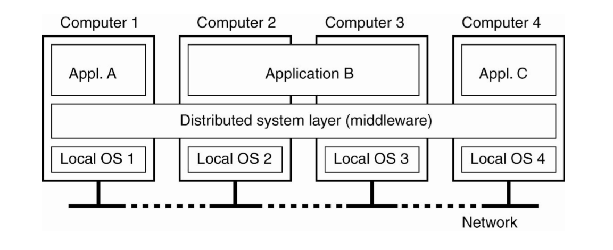
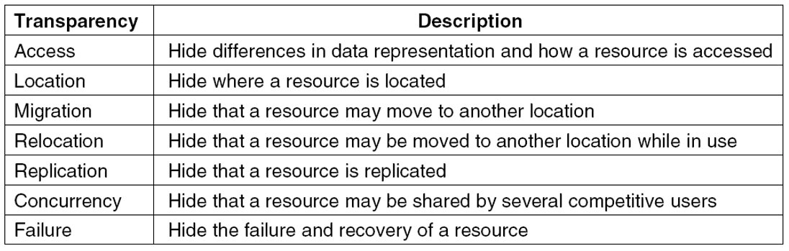
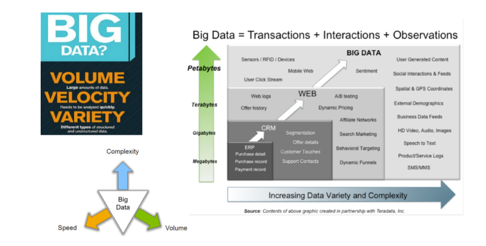
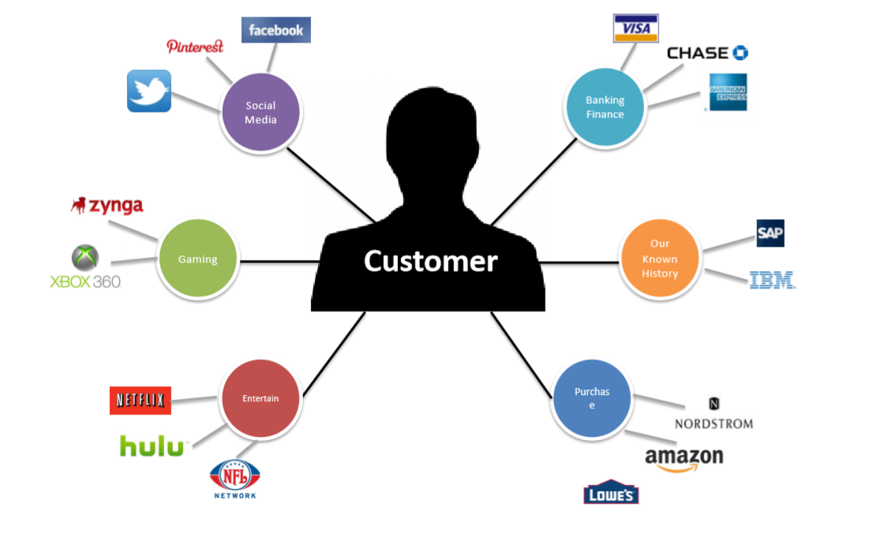
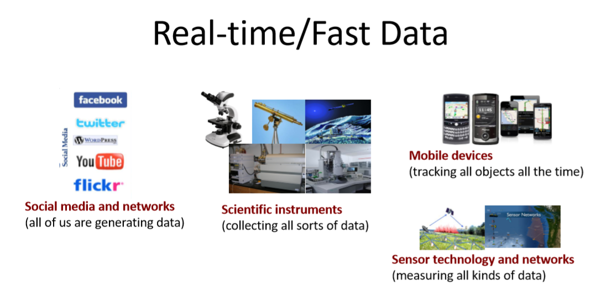
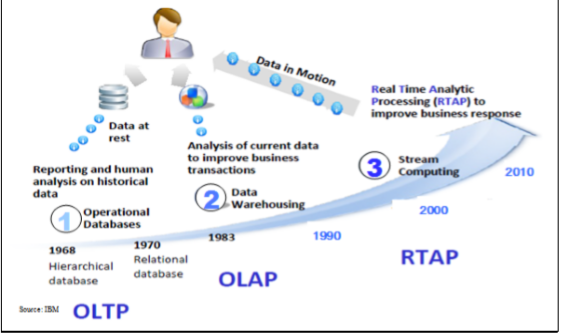
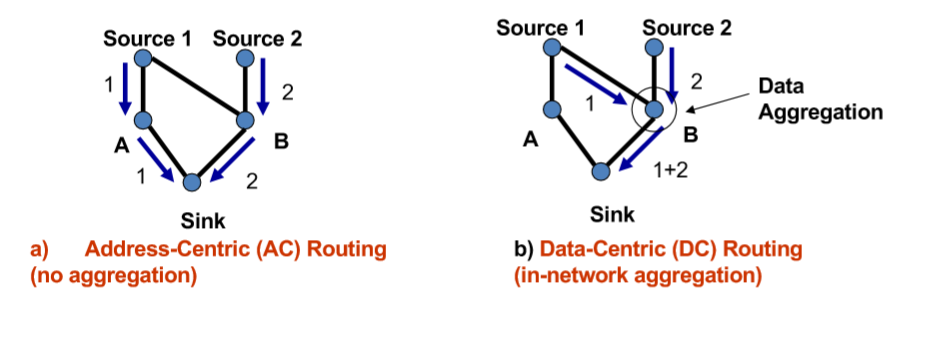
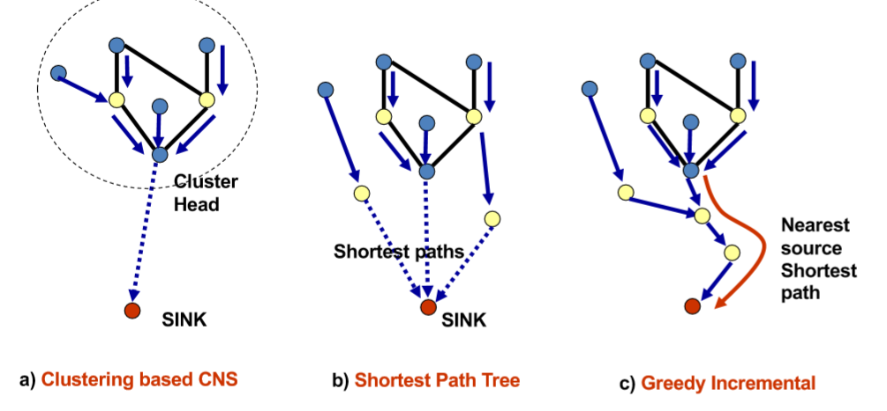

# In The Name of Allah 

## The Final Exam In Shaa AllAH 
 Dr Mohammad El-Hosieny ordered that Final Exam Contain only the 7 chapters 


|Slides| Contributions|
|:--:|:--|
| Intro To DDB|Contributed|
| Transparency |Non|
|DDB Design|Non|
| Concurrency Control|Non|
| DDB Security|Contributed|
| Real time DB |Contributed|
| Big Data |Contributed|


# Some of Studies & Contributions

# Intro To DDB
---
## Distributed Systems:
> A __distributed system__ is: A collection of __independent computers__ that appears to its users as a __single coherent system__.


> If you really need to know about the Generation of Distributed Systems:

 - Databased Architictures
      - Distributed DB
 - Software Based
    - RPC, gRPC => Microsoft Blazor Engine
    - REST Softwares (GET , POST , Delete ,PUT) HTTP Based Methods=> Dotnet APIS
    - CORBA (Broker Based)
  - Process Based
     - SOA (Coarse Grained Services) WSDL(SOAP/HTTP) => Microsoft WCF
     - Microservice Architecture (Fine Grained Services) => Dotnet MCS (The Best Choice in Real world Enterprise Challenges)

> In Distributed System the Distribution must be Transparent from users to solve the complexity and Security so let's discover the Transparency models :
> 

## Distributed Database

 > It is a system to process a __Unit of execution__ (a transaction)in a distributed manner.

 > That is, a __transaction__ can be executed by __multiple networked computers__ in a __unified manner__.

 > __A distributed database (DDB)__ is a collection of multiple __logically interrelated databases__ distributed over a computer network 
 
 > __distributed database management system__(DDBMS) a software system that manages a distributed database while making the distribution transparent to the user.

## So DDBS = DDB + DDBMS

## The Concurrency control Methods for DDB (The Distributed Environment ):-

- Locking (Pessimistic approach )
  - Majority
  - Biased (Shared Read/ Exclusive Write Locks)
  - 2 Phase Locking
- The Timestamp Ordering
- The Optimistic Approach
- Hybrid

## Majority 

> Local lock manager at each site administrates lock and unlock requests for data item stored at that site.


### UnReplicated data:

- Let (S) to be the site where data item (Q) are to be used for Read or Write

- When Transaction T need to lock the Q it sends to S (The Lock manager)

- If Q is locked in an incompatible mode, then the request is delayed until it can be granted.
- if Q can be granted, the local manager sends a message back to lock the item .

### Replicated Data:

- Q = Replicated item  , n the sites contain Q
- The Request must be sent to more half of the sites contain Q (The Request Messages >= 1/2 N)
- The T can not obtain Q until the majority of N grant the lock
- When Read , from one site -- When Write , performing Writes in all of the N.

### Benefits 
> It Can be used when some sites are unavailable

### Drawbacks
> Requires __2(n/2+1)__ messages for handling the __locks__ and __(n/2+1)__ to handle __unlocks__

> Potential for __Deadlock__ even with single item , each 3 transactions can have locks on 1->3 rd of the replicas of a data


## Biased Protocol
> There are 2 types of lock (Shared => __Read Lock__ , Exclusive => __Write Lock__  ) and they are not manipulated the same so it's Biased.

> __The Shared Lock__ : When The Local Transaction Manager need to read a data Q then it sends a request to __only one site__ from the replicas sites=> One Request (Advantage)
```
Shared Lock بتقفل منطقة واحدة بس عشان كده بتطلب 
 one request per Transaction Read
```
> __The Exclusive Lock__:  When The Local Transaction Manager need to Write a data Q then it sends a request to __all the sites__ that contain Q => More overhead on Writes Requests (Disadvantage)
```
Execlusive Lock بتقفل كل المناطق اللى بتحتوى على الداتا بس عشان كده بتطلب 
Every Replica contain Q it locks the item
```

# DDBMS Security

## Data Security
> Protect Data from Unauthorized Access
> There are 2 main Aspects:

### 1- Data Protection
> Achieved Using data encryption Technique
 - Uses Encryption/Decryption techniques (Key Generators =>Public/Private Keys => RSA ,GPG ,MD5 , HMAC256 .....)

```
بحمى أصل البيانات من ان اللى مش مسموح له القراءة تكون اليانات اللى هيحصل عليها متشفرة مش هيعرف يفكها الا بالمفتاح اللى هو مجموعة من الحروف اللى مع الأجهزة بس المسموح لها القراءة 
```

> Prevents the physical content to be understood by unauthorized users.

### 2- Authorization Control
> Only authorized users perform operations they are allowed to on database objects

> There are many types of Access control Methods for DDB:
- __DAC Discertionary Access Control__
   - Based on __Privileges__ and __access rights__
   - Long been provided by DBMS with __authorization rules__.
   - Have 3 Actors => Matrix of 2 Dimensions ,  every cell can be shown as a Tuple of 3 Item
   -  __Authorization__ = (__Subject__ => User or Group that manipulate data , __Operation__=> type of Query , __Object__ => where operation be performed)
   -  Defined by __Granting__ The Access => *__GRANT__* and __Revoking__ The Access __*REVOKE*__.
   -  2 Ways to Perform Granting /Revoking
   -  __Centralized__ => __only one__ can Grant users the Accessibility (admin) and can revoke , no one can than admin
   -  __Decentralized__ => If User have the access on Data ,he can grant any another user this access and the another can either 
      -  More Flexible.
      - So A __Hierarchy__ of Grants => Then if The admin Revoked The access a __recursive revoke__ to all users in hierarchy revoked.
- MAC __Multilevel or Mandatory__ Access Control => Bel Labadula +> See Wikipedia
  - Based on __Policies__ that __can't be changed__ by __individual users__.
  - __increasing__ security using __security levels__.
  - __More__ Security Levels => __Clearances__
  - *Top Secret* > *Secret* > *Confidential* > *unclassified*
  - Access Controlled by 2 Rules 
  - No Read Up
      - the subject S can read object of level L <==> Level(S)>= L
      - protect data from unauthorized disclosure
          - The Secret Clearance can not Read from the Top Secret data.

  - No Write Down
      - Subject S is allowed to write an object of Level L <==> Level(S)<=L
      - protect data from unauthorized change
          - Subject with top Secret Clearance can only write top secret data
- __RBAC Role Based Access Control__ => مش فى المنهج


## Semantic Data Control
> ensures that __authorized users__ perform __correct operations__ on the DB, Contributing to the maintenance of the __database integrity__.
- View Management
- Security Control
- Integrity Control

### View Management
> View is Virtual Relation generated from base Relation/s by a query
```
Language = "TSQL" => Microsoft Based

CREATE VIEW Sysan(ENO,ENAME)
AS SELECT ENO , ENAME
     From EMP
     WHERE TITLE = "Syst. Anal."
```

> not stored as a __base relation__ => Stored as a __query definition__.

> Can Be __Manipulated__ as a __base relation.__

> Used To __restrict Access__.

### DDB Concerns on Views 
 - Might be Derived from Fragments
 - View Definition Storage should be treated as a DB Storage.
 - Might be costly , if Base Relation is Distributed.
 - To Solve The Processing problem using SnapShots => __"Materialized Views "__
     - Static Views => as a snapshot it doesn't mirror or reflect the updates of the base relation until it reshotted /Scanned Again from the base.
     - managed as a temporary relation - only access path is sequential scan => because the user less possible use it again.
     - __bad selectivity__ Defined as __pre-calculated answers__ => the number of tuples in Base relation doesn't equal the Snapshot
     - Periodic recalculation => to Recognize the right selectivity and right reflected updates

## Semantic Integrity Control
> Maintain DB consistency by enforcing a set of constraints defined on the DB.

> Contain 2 Components
 - Integrity constraint specification
 - Integrity constraint enforcement

### Classification of Specification Constraints

- Structural Vs Behavioral
- Procedural vs Declarative
- Predefined vs Precompiled 
- General Constraints

|Constraint Type|Definition|Example|
|:--|:--|:--|
|__Structural__|Basic Semantic Properties inherent to a data model |Unique key , Not Null ,Type(int , nchar)|
|__Behavioral__|regulate application behavior| Dependencies in relational model => Functional Dependency (The age is calculated from DOB) or The Relation Dependency (one to one ,....)|
|__Procedural__|Control embedded in each application program |Triggered , Like The Validation and Security in (Web /mobile app)|
|__Declarative__|<li>assertion in predicate calculus</li><li>Easy to define constraints</li><li>Definition of DB consistency clear </li><li>inefficient to check assertion for each update<ul><li>limit in search space </li><li>Decrease the number of Data assess/assertion</li><li>Preventive Strategy</li><li>Checking at compile time</li></ul></li> |CHECK  ON \<Relation> WHEN \<Update Type> \<Qualification>|
|__Predefined__ | In The Schema building(More common constraints of the relational model)|Not Null, Unique Key , Foreign key , Functional Dependency|
|__Precompiled__|Preconditions that must be specified by all tuples|Defined by The __*CHECK*__|

# Real Time Distributed Database 

> **_Real-Time Data Base System_** can be defined as those computing systems that are designed to operate in a __timely manner__.

- It must perform certain actions within specific __timing constrains__ (producing results while meeting predefined deadlines)

> __*Real-Time Distributed Data Base System*__ can also be defined as Traditional Distributed Databases that uses an extension to give additional power to yield __reliable response__.


- Distributed Databases with the __added constraint__ of completing operations within a __certain amount of time__ to accurately reflect the outside world.
## Strategies must consider system attributes
- Hard or Soft
- Concurrency Control
- Replication

## __Hard or Soft__


- __Soft-Deadline:__
  - __desirable__ but __not critical__ 
  - missing a soft-deadline does not cause a system failure or compromises the system’s integrity.
  - Example: __operator switchboard for a telephone__.


- __Firm-DeadLine__
  - Desirable but not critical __(like Soft-Deadline case)__ 
  - It is __not executed__ after its deadline and no value is gained by the system from the tasks that miss their deadlines
  - Example: __an autopilot system__

- __Hard-Deadline:__ 
   - Timely and logically correct execution is considered to be __critical__
   - Missing a hard-deadline can result in catastrophic consequences 
   - Also known as __Safety-Critical__ 
   - Example: __data gathered by a sensor__ 

|Hard|Soft|
|:-|:-|
|• __Strict__ timing constraints|• __Less strict__ timing constraints |
|• Data and Service guaranteed|• Failure to meet deadlines __not dangerous__|
|• Deadlines met to __avoid catastrophe__|• Value of data __declines__ after deadline|
|• __Example:__ <li> Control tower notifying planes where to land in inclement weather</li> <li>  Burglary System dispatch</li> |• Example: Checkout line growing in a grocery store.|

## __Design Paradigms__

- __Time-Triggered (TT)__
  - Systems are initiated as __predefined instances__ 
  - Assessments of resource requirements and resource availability is required 
  - TT architecture can provide __predictable behavior__ due to its pre-planed execution pattern.
- __Event-Triggered (ET)__
   -  Systems are initiated in __response__ to the occurrence of particular __events__ that are possibly caused by the environment
   - The resource-need  assessments in ET architecture is  usually __probabilistic__ 
   - ET is not as reliable as TT but provides more flexibility and ideal for more classes of applications
       - TT is more reliable
       - ET is more flexible and ideal for many apps
    - ET behavior usually is __not predictable.__

## __Tasks Periodicity__
  - __Prosodic Tasks__ 
     - Executes at __regular intervals__ of time Corresponds to __TT architecture__ 
     -  Have __Hard-Deadlines__ characterized by their periods __(requires worst-case analysis)__.

  -  __Aperiodic Tasks__ 
     - Execution time __cannot be priori anticipated__
     -  Activation of tasks is __random event__ caused by a __trigger__ Corresponds to __ET architecture__ - Have __Soft-Deadlines__ **_(no worst-case analysis)_**

  - __Sporadic Tasks__ 
     - Tasks which are __aperiodic in nature__, but have __Hard-Deadlines__ 
     - Used to handle __emergency conditions__ or __exceptional situations__ 
     - Worst-case calculations is done using __Schedulability-Constraint__
     - > **_Schedulability-Constraint_** defines a __minimum period__ between any __two sporadic events__ from the __same source__.

## __Scheduling__
 - Each task within a real-time system has 
   - Deadline 
   - An arrival time
   - Possibly an estimated worst-case execution 
 - A __*Scheduler*__ can be defined as an __algorithm or policy__ for __ordering the execution__ of the outstanding process 
 - __*Scheduler*__ maybe: 
   - __Preemptive__ Can arbitrarily __suspend and resume__ the execution of the task __without affecting its behavior__
   - __Non-preemptive__
     - A task must be run __without interruption__ until completion :
       - Hybrid :  Preemptive scheduler, but preemption is only allowed at certain points within the code of each task. 
    - __Real-Time scheduling__ algorithms can be :
       - __Static__ : Known as __fixed-priority__ where priorities are computed __off-line__
          -  Requires complete __priori knowledge__ of the real-time environment in which is deployed
          - __Inflexible__ : scheme is workable only if all the tasks are __effectively periodic__.
          -  Can work only for __simple systems__, performs inconsistently as the load increases.
    - __Dynamic__  : Assumes __unpredictable__ task-arrival times 
      -  Attempts to schedule tasks __dynamically upon arrival__ 
      -  Dynamically computes and assigns a priority value to each task 
    - Decisions are based on task characteristics and the current state of the system 
      - __Flexible__ :  scheduler that can deal with __unpredictable events__. 

## __Priority-Based Scheduling__
 -  Conventional scheduling algorithms aims at __balancing__ the number of __CPU-bound and I/O bound__ jobs to maximize system __utilization and throughput__ - Real-Time tasks need to be scheduled according to their __criticalness and timeliness__ 
 - Real-Time system must ensure that the progress of __higher-priority__ tasks __(ideally) is never hindered__ by lower-priority tasks.
### __Priority-Based Scheduling Methods__ 
-  __Earliest-Deadline-First (EDF)__: 
   - the task with the current closest __(earliest)__ deadline is assigned the highest priority in the system and executed next 
 - __Value-Functions__ : __highest value (benefit) first__ 
   - the scheduler is required to __assign priorities__ as well as defining the system values of completing each task at any instant in time.
 - __Value-Density (VD):__ __highest (value/computation) first__
    - The scheduler tends to select the tasks that __earn more value per time__ unit they consume 
    - It is a __greedy technique__ since it always schedules that task that has the __highest expected value__ within the shortest possible time unit. 
 - __Complex functions of deadline__, value and slack time.

## __Concurrency Control in Real Time DDB__
> Ensures data is __accurate__ in a real-time distributed system
-  Two main approaches: 
   -  Prevent Collisions __(Pessimistic)__ 
   - Detect Collisions and Respond __(Optimistic)__

 - __Pessimistic Real-time Concurrency Control__
    - __Two-Phase Locking:__ 
      -  Transactions acquire __locks on data__ 
      -  After transaction completed, locks are removed. 
      -  Ensures that data integrity __isn’t compromised__.
      -  Disadvantages to 2PL: 
         -  Don’t scale well to real time distributed systems 
         -  Difficult to maintain locks at different locations 
         - Problems inherent to locking multiplied by number of sites
 - __Optimistic Concurrency Control__ OCC:
    - Assumed that collisions won’t occur 
    - Few or no read restrictions 
    - Initial writing takes place on copy of data 
    - Course of action can be decided based on collision
Optimistic Concurrency Control
    - __Disadvantages to OCC:__ • The less servers, the more likely collisions  
    - Collisions always cause rollbacks 
    - Time wasted while restarting transactions
Variations on CC
 - __Neither OCC nor PCC perfect for RTDDBS__ 
   -  Variations/Augmentations frequent: 
      - DHP-2PL 
      - OCC Wait-50
## __Replication Strategies in Real-Time Distributed Databases__
 - Replication 
   - Deadlines must be met 
   - Fault tolerance 
   - Failure Transparency 
   - Replication helps maintain __Quality of Service__ and Data Freshness

|Eager Update| Lazy Update|
|:-|:-|
|Replicas updated as transaction happens.|Replicas updated after transaction committed.|
|High response times from clients.|Chance for inconsistency.|
|Locked longer.||
|High Overhead||

---
|Update Anywhere | Primary Copy|
|:-|:-|
|Any replica can update other replicas.|One replica designated as “server”.|
|Good for fault tolerance.|Good for read-only transactions.|
|High synching and update times.|Restarts at server mean long waits and missed deadlines|

- __Alternative: Partial Replication__
  - JITRTR: Replicate as needed. 
  - Only parts of the database replicated to cut down on overhead. 
  -  Works best in static system
---
# In The Name Of Allah
---
# Big Data

## What’s Big Data?
> is the term for a __collection of data sets__ so __large__ and __complex__ that it becomes __difficult to process__ using __on-hand database__ management tools or traditional data processing applications.

{هى مجموعة من تجميعات البيانات الضخمة و المعقدة و صعبة المعالجة باستخدام الطرق التقليدية او المسنخدمة عادتا }


|||||challenges||||
|:-|:-|:-|:-|:-|:-|:-|:-|
|capture| curation| storage| search| sharing| transfer|analysis|visualization| 


- The trend to __larger data sets__ is due to the additional information derivable from analysis of a __single large set of related data__
-  as compared to separate smaller sets with the same total amount of data, allowing correlations to be found to :
    - spot business trends
    - determine quality of research
    - prevent diseases
    - link legal citations
    - combat crime
    - determine real-time roadway traffic conditions

## 3 V'S
 - __Volume__ 
 - __Velocity__
 - __Variety__
 - Every new year data volume{Mega , Giga , Tera , Peta , Exa , zetta , yotta ,hecta ,..} is increased by a huge changable velocity because new systems {ERP , CRM, Web , ......} are built with new varieties of data extensions .
 - more complexity to process the data


> "Big Data are __high-volume__, __high-velocity__, and/or __high-variety information__ assets that require __new forms of processing__ to enable enhanced __decision making__, insight discovery and __process optimization__”
 - __Complicated (intelligent) analysis__ of data may make a __small data__ “appear” to be “big” 
 - __*Bottom line*__: Any data that __exceeds our current capability__ of processing can be regarded as "big"

 ```
 هناك 3 محاور للداتا تتزايد عاما بعام و هم الحجم و سرعة الازدياد و التنوع بسبب زيادة المتطلبات البشرية من البرمجيات المتعددة الأغراض و السينسورز
 هذه البيانات تحتاج الى كم كبير من المعالجة الغير تقليدية لاستخدلمها فى التحليل و التنبؤ 
 بعض تحليل الداتا صغيرة الحجم ينتج عنها كم كبير من المعلومات
 أى بيانات تتعدى القدرات
 للمعالجات هى ال 
 Big Data
 ```

 ## Volume (Scale) 
  - __Data Volume__ : 44x increase from 2009 2020 – From 0.8 zettabytes to 35zb
  -  Data volume is increasing __exponentially__


---

## Variety (Complexity)



|||
|:-|:-|
|<li> __Relational Data__ (Tables/Transaction/Legacy Data) </li><li> Text Data (Web) </li><li>Semi-structured Data (XML , JSON , YAML) </li> <li>Graph Data – Social Network, __Semantic Web (RDF)__</li><li>  Streaming Data – You can only scan the data once</li><li> A single application can be generating/collecting many types of data  </li><li> Big Public Data (online, weather, finance, etc) <li></li>  |  |

---
## Velocity (Speed)

- Data is begin __generated fast__ and need to be __processed fast__ 
- Online Data Analytics 
- Late decisions __missing opportunities__
- Examples 
   - __E-Promotions__: Based on your current location, your purchase history, what you like send promotions right now for store next to you
   - __Healthcare monitoring__: sensors monitoring your activities and body  any abnormal measurements require immediate reaction
- 
- The __progress and innovation__ is no longer hindered by the ability to collect data
- But, by the ability to __manage, analyze, summarize, visualize, and discover knowledge__ from the collected data in a timely manner and in a scalable fashion.

---
## Harnessing Big Data

- OLTP: Online Transaction Processing   (DBMSs) 
- OLAP: Online Analytical Processing   (Data Warehousing) 
- RTAP: Real-Time Analytics Processing  (Big Data Architecture & technology)
- 
- 
---
## Big Data Analytics
- Big data is more __real-time__ in nature than traditional DW applications
- Traditional DW architectures (e.g. Exadata, Teradata) are __not well suited__ for big data apps
- __Shared nothing, massively parallel processing, scale out architectures__ are well-suited for big data apps
---

## Data Aggregation in Sensor Networks

- __Redundant Data__/events
- Some services are amenable for in-network computations. – “The network is the sensor” 
- __Communication__ can be __more expensive__ than computation. 
- By performing “computation” on data in route to the sink, we can __reduce the amount of data traffic__ in the network. 
- Increases energy efficiency as well as scalability 
- The __bigger the network__, the more __computational resources__.


---
## Transmission modes AC vs DC

## Aggregation Techniques
- __*Center at Nearest Source (CNSDC)*__: All sources send the information first to the source nearest to the sink, which acts as the aggregator.  
- __*Shortest Path Tree (SPTDC)*__: Opportunistically merge the shortest paths from each source wherever they overlap. 
__*Greedy Incremental Tree (GITDC)*__: Start with path from sink to nearest source. Successively add next nearest source to the existing tree.


## Data Storage in Sensors Model 
- The data that is generated at one node is stored at another node determined by the name of the data.
- Data must be named 
- Data can be stored and retrieved by name. 
- Generally speaking, a data-centric storage system provides primitives of the form: 
   - put (data) and 
   - data = get (name).
- __External Storage__: The cost of __accessing the event is zero__, while the cost of conveying the data to this external node is nontrivial, and significant energy is expended at nodes near the external node
    -  Appropriate if the events are accessed far more frequently than generated.
- __Local Storage__: Incurs __zero communication cost__ in storing the data, but incurs a large communication cost –a network flood–in accessing the data.
    -  Feasible when events are accessed less frequently than they are generated. 
- __Data-Centric Storage__:lies __in between__, incurs __non-zero cost__ both in storing events and retrieving them.
---


## This Course Is Indrotuced by Dr : Mohammad El-Hosieny
### @AhmedKhalil contribution 2019/2020
