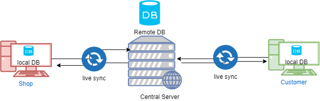
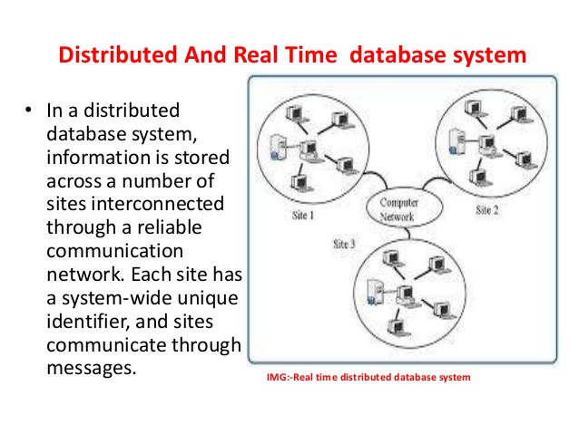
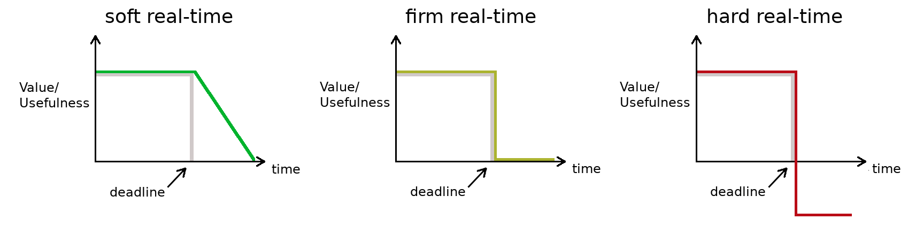

# In The Name Of ALLAH
---
# Real Time Distributed Database 
> **_Real-Time Data Base System_** can be defined as those computing systems that are designed to operate in a __timely manner__.

- It must perform certain actions within specific __timing constrains__ (producing results while meeting predefined deadlines)

> __*Real-Time Distributed Data Base System*__ can also be defined as Traditional Distributed Databases that uses an extension to give additional power to yield __reliable response__.

- Distributed Databases with the __added constraint__ of completing operations within a __certain amount of time__ to accurately reflect the outside world.
## Strategies must consider system attributes
- Hard or Soft
- Concurrency Control
- Replication

## __Hard or Soft__

- __Soft-Deadline:__
  - __desirable__ but __not critical__ 
  - missing a soft-deadline does not cause a system failure or compromises the system’s integrity.
  - Example: __operator switchboard for a telephone__.

- __Firm-DeadLine__
  - Desirable but not critical __(like Soft-Deadline case)__ 
  - It is __not executed__ after its deadline and no value is gained by the system from the tasks that miss their deadlines
  - Example: __an autopilot system__

- __Hard-Deadline:__ 
   - Timely and logically correct execution is considered to be __critical__
   - Missing a hard-deadline can result in catastrophic consequences 
   - Also known as __Safety-Critical__ 
   - Example: __data gathered by a sensor__ 

|Hard|Soft|
|:-|:-|
|• __Strict__ timing constraints|• __Less strict__ timing constraints |
|• Data and Service guaranteed|• Failure to meet deadlines __not dangerous__|
|• Deadlines met to __avoid catastrophe__|• Value of data __declines__ after deadline|
|• __Example:__ <li> Control tower notifying planes where to land in inclement weather</li> <li>  Burglary System dispatch</li> |• Example: Checkout line growing in a grocery store.|

## __Design Paradigms__
 - __Time-Triggered (TT)__
   - Systems are initiated as __predefined instances__ 
   - Assessments of resource requirements and resource availability is required 
   - TT architecture can provide __predictable behavior__ due to its pre-planed execution pattern.
 - __Event-Triggered (ET)__
   -  Systems are initiated in __response__ to the occurrence of particular __events__ that are possibly caused by the environment
   - The resource-need  assessments in ET architecture is  usually __probabilistic__ 
   - ET is not as reliable as TT but provides more flexibility and ideal for more classes of applications
       - TT is more reliable
       - ET is more flexible and ideal for many apps
    - ET behavior usually is __not predictable.__

## __Tasks Periodicity__
  - __Prosodic Tasks__ 
     - Executes at __regular intervals__ of time Corresponds to __TT architecture__ 
     -  Have __Hard-Deadlines__ characterized by their periods __(requires worst-case analysis)__.

  -  __Aperiodic Tasks__ 
     - Execution time __cannot be priori anticipated__
     -  Activation of tasks is __random event__ caused by a __trigger__ Corresponds to __ET architecture__ - Have __Soft-Deadlines__ **_(no worst-case analysis)_**

  - __Sporadic Tasks__ 
     - Tasks which are __aperiodic in nature__, but have __Hard-Deadlines__ 
     - Used to handle __emergency conditions__ or __exceptional situations__ 
     - Worst-case calculations is done using __Schedulability-Constraint__
     - > **_Schedulability-Constraint_** defines a __minimum period__ between any __two sporadic events__ from the __same source__.

## __Scheduling__
 - Each task within a real-time system has 
   - Deadline 
   - An arrival time
   - Possibly an estimated worst-case execution 
 - A __*Scheduler*__ can be defined as an __algorithm or policy__ for __ordering the execution__ of the outstanding process 
 - __*Scheduler*__ maybe: 
   - __Preemptive__ Can arbitrarily __suspend and resume__ the execution of the task __without affecting its behavior__
   - __Non-preemptive__
     - A task must be run __without interruption__ until completion :
       - Hybrid :  Preemptive scheduler, but preemption is only allowed at certain points within the code of each task. 
    - __Real-Time scheduling__ algorithms can be :
       - __Static__ : Known as __fixed-priority__ where priorities are computed __off-line__
          -  Requires complete __priori knowledge__ of the real-time environment in which is deployed
          - __Inflexible__ : scheme is workable only if all the tasks are __effectively periodic__.
          -  Can work only for __simple systems__, performs inconsistently as the load increases.
    - __Dynamic__  : Assumes __unpredictable__ task-arrival times 
      -  Attempts to schedule tasks __dynamically upon arrival__ 
      -  Dynamically computes and assigns a priority value to each task 
      - Decisions are based on task characteristics and the current state of the system 
      - __Flexible__ :  scheduler that can deal with __unpredictable events__. 

## __Priority-Based Scheduling__
• Conventional scheduling algorithms aims at balancing the number of CPU-bound and I/O bound jobs to maximize system utilization and throughput • Real-Time tasks need to be scheduled according to their criticalness and timeliness • Real-Time system must ensure that the progress of higher-priority tasks (ideally) is never hindered by lower-priority tasks.