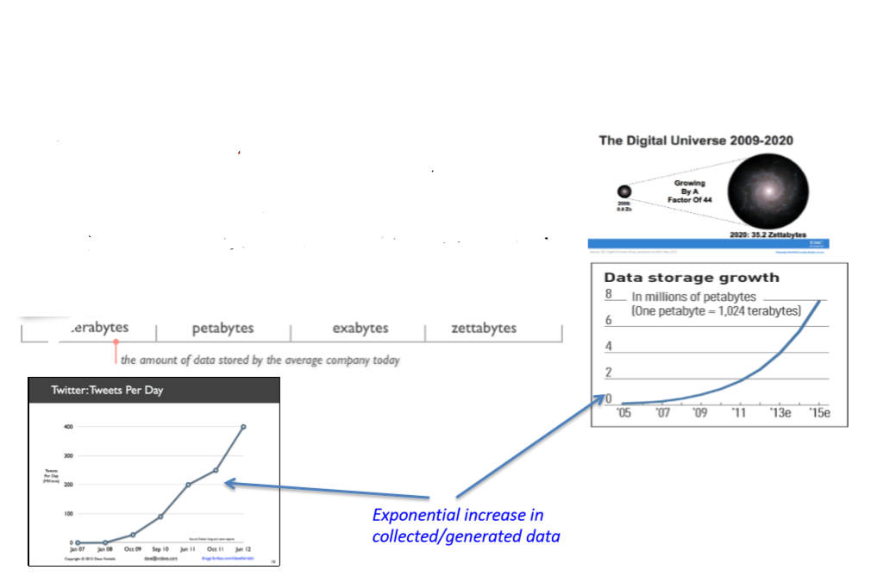
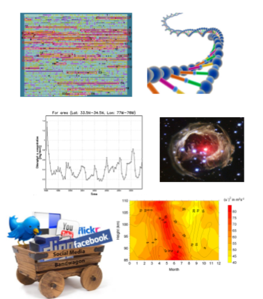
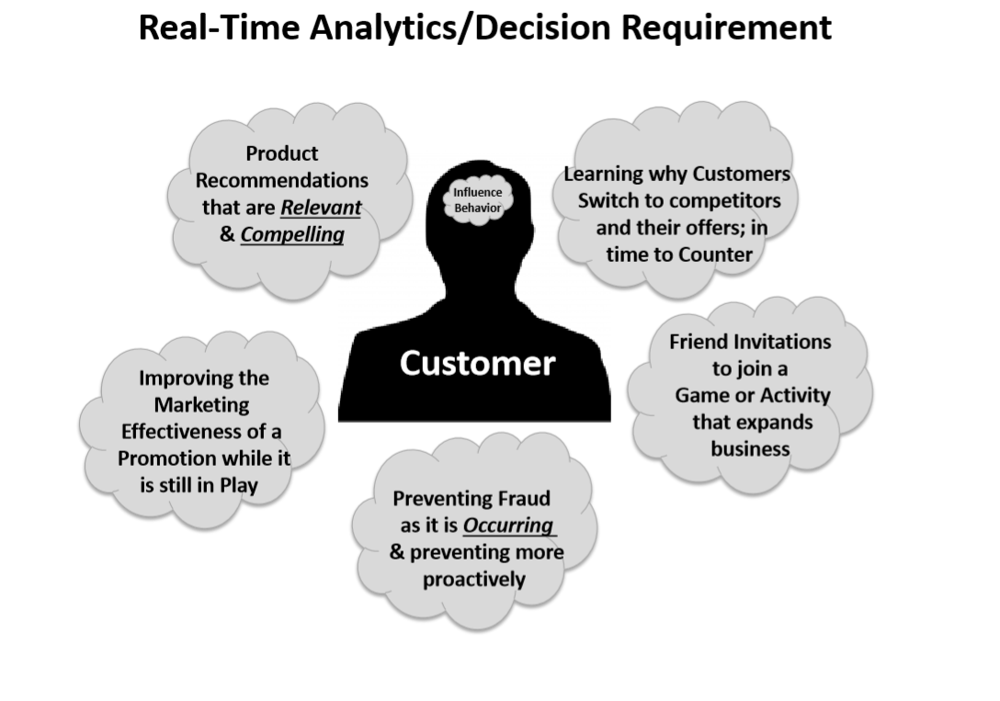
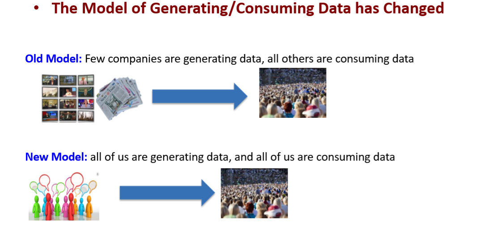
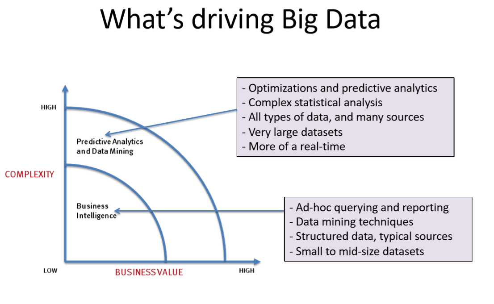
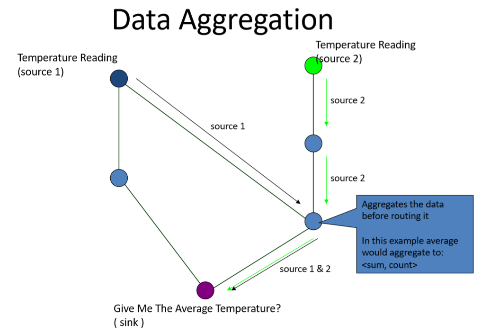

# In The Name Of Allah
---
# Big Data

## What’s Big Data?
> is the term for a __collection of data sets__ so __large__ and __complex__ that it becomes __difficult to process__ using __on-hand database__ management tools or traditional data processing applications.

{هى مجموعة من تجميعات البيانات الضخمة و المعقدة و صعبة المعالجة باستخدام الطرق التقليدية او المسنخدمة عادتا }


|||||challenges||||
|:-|:-|:-|:-|:-|:-|:-|:-|
|capture| curation| storage| search| sharing| transfer|analysis|visualization| 


- The trend to __larger data sets__ is due to the additional information derivable from analysis of a __single large set of related data__
-  as compared to separate smaller sets with the same total amount of data, allowing correlations to be found to :
    - spot business trends
    - determine quality of research
    - prevent diseases
    - link legal citations
    - combat crime
    - determine real-time roadway traffic conditions

## 3 V'S
 - __Volume__ 
 - __Velocity__
 - __Variety__
 - Every new year data volume{Mega , Giga , Tera , Peta , Exa , zetta , yotta ,hecta ,..} is increased by a huge changable velocity because new systems {ERP , CRM, Web , ......} are built with new varieties of data extensions .
 - more complexity to process the data


> "Big Data are __high-volume__, __high-velocity__, and/or __high-variety information__ assets that require __new forms of processing__ to enable enhanced __decision making__, insight discovery and __process optimization__”
 - __Complicated (intelligent) analysis__ of data may make a __small data__ “appear” to be “big” 
 - __*Bottom line*__: Any data that __exceeds our current capability__ of processing can be regarded as "big"

 ```
 هناك 3 محاور للداتا تتزايد عاما بعام و هم الحجم و سرعة الازدياد و التنوع بسبب زيادة المتطلبات البشرية من البرمجيات المتعددة الأغراض و السينسورز
 هذه البيانات تحتاج الى كم كبير من المعالجة الغير تقليدية لاستخدلمها فى التحليل و التنبؤ 
 بعض تحليل الداتا صغيرة الحجم ينتج عنها كم كبير من المعلومات
 أى بيانات تتعدى القدرات
 للمعالجات هى ال 
 Big Data
 ```

 ## Volume (Scale) 
  - __Data Volume__ : 44x increase from 2009 2020 – From 0.8 zettabytes to 35zb
  -  Data volume is increasing __exponentially__



---

## Variety (Complexity)


|||
|:-|:-|
|<li> __Relational Data__ (Tables/Transaction/Legacy Data) </li><li> Text Data (Web) </li><li>Semi-structured Data (XML , JSON , YAML) </li> <li>Graph Data – Social Network, __Semantic Web (RDF)__</li><li>  Streaming Data – You can only scan the data once</li><li> A single application can be generating/collecting many types of data  </li><li> Big Public Data (online, weather, finance, etc) <li></li>  |  |

---
## Velocity (Speed)

- Data is begin __generated fast__ and need to be __processed fast__ 
- Online Data Analytics 
- Late decisions __missing opportunities__
- Examples 
   - __E-Promotions__: Based on your current location, your purchase history, what you like send promotions right now for store next to you
   - __Healthcare monitoring__: sensors monitoring your activities and body  any abnormal measurements require immediate reaction
- 
- The __progress and innovation__ is no longer hindered by the ability to collect data
- But, by the ability to __manage, analyze, summarize, visualize, and discover knowledge__ from the collected data in a timely manner and in a scalable fashion.

---
## Harnessing Big Data

- OLTP: Online Transaction Processing   (DBMSs) 
- OLAP: Online Analytical Processing   (Data Warehousing) 
- RTAP: Real-Time Analytics Processing  (Big Data Architecture & technology)
- 
- 
---
## Big Data Analytics
- Big data is more __real-time__ in nature than traditional DW applications
- Traditional DW architectures (e.g. Exadata, Teradata) are __not well suited__ for big data apps
- __Shared nothing, massively parallel processing, scale out architectures__ are well-suited for big data apps
---

## Data Aggregation in Sensor Networks

- __Redundant Data__/events
- Some services are amenable for in-network computations. – “The network is the sensor” 
- __Communication__ can be __more expensive__ than computation. 
- By performing “computation” on data in route to the sink, we can __reduce the amount of data traffic__ in the network. 
- Increases energy efficiency as well as scalability 
- The __bigger the network__, the more __computational resources__.


---
## Transmission modes AC vs DC

## Aggregation Techniques
- __*Center at Nearest Source (CNSDC)*__: All sources send the information first to the source nearest to the sink, which acts as the aggregator.  
- __*Shortest Path Tree (SPTDC)*__: Opportunistically merge the shortest paths from each source wherever they overlap. 
__*Greedy Incremental Tree (GITDC)*__: Start with path from sink to nearest source. Successively add next nearest source to the existing tree.


## Data Storage in Sensors Model 
- The data that is generated at one node is stored at another node determined by the name of the data.
- Data must be named 
- Data can be stored and retrieved by name. 
- Generally speaking, a data-centric storage system provides primitives of the form: 
   - put (data) and 
   - data = get (name).
- __External Storage__: The cost of __accessing the event is zero__, while the cost of conveying the data to this external node is nontrivial, and significant energy is expended at nodes near the external node
    -  Appropriate if the events are accessed far more frequently than generated.
- __Local Storage__: Incurs __zero communication cost__ in storing the data, but incurs a large communication cost –a network flood–in accessing the data.
    -  Feasible when events are accessed less frequently than they are generated. 
- __Data-Centric Storage__:lies __in between__, incurs __non-zero cost__ both in storing events and retrieving them.