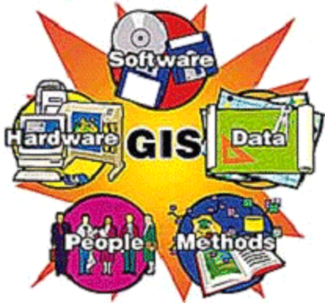
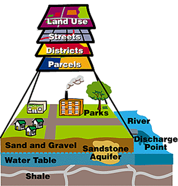
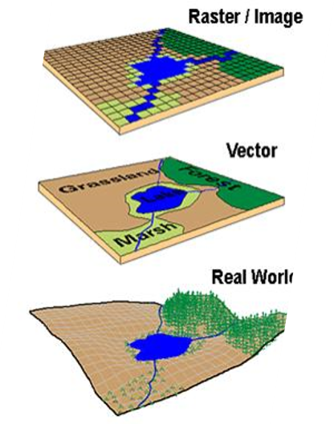
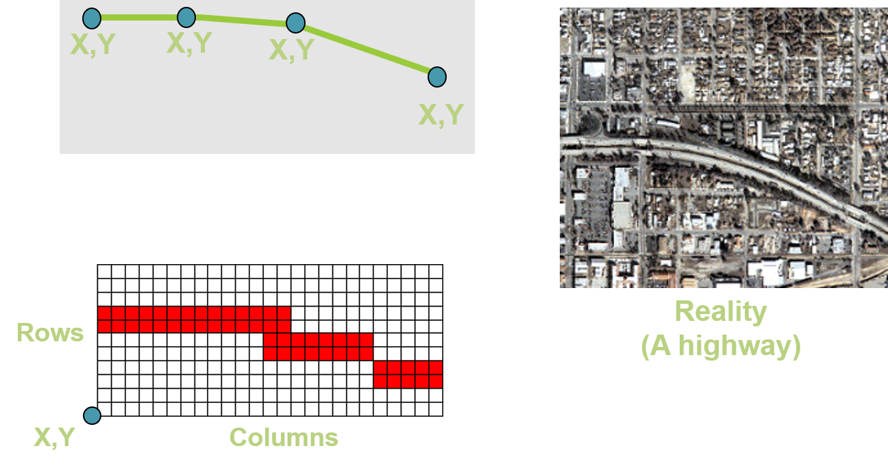
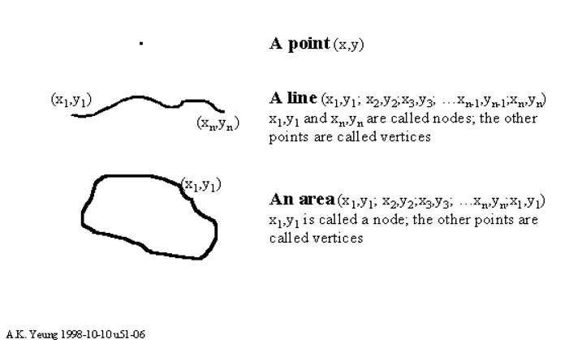
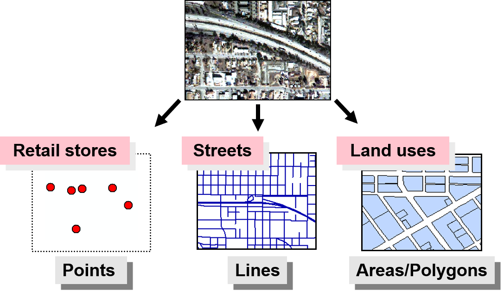
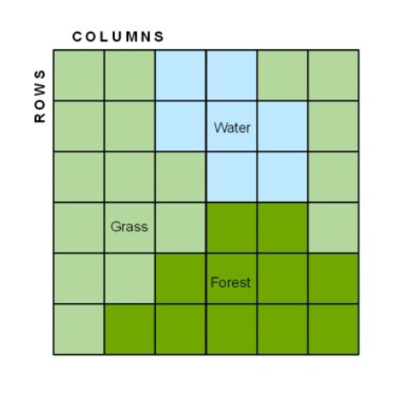
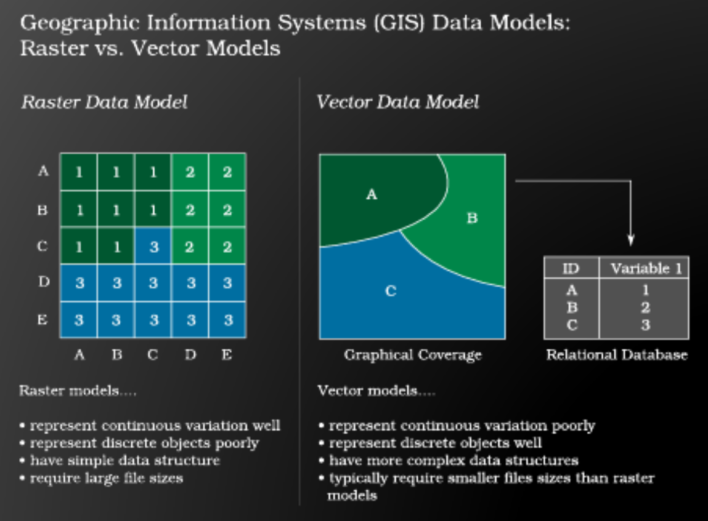

## This Course Is Indrotuced by Dr : Ahmed Abu El-Ftouh & Dr: Nabila Hamed

## Lecture 2

### What is the GIS?

> A geographic information system (GIS) is a __computer-based tool__ for _mapping_ and _analyzing_ geographic phenomenon that exist, and events that occur, on Earth

> GIS technology integrates common __database operations__ such as _query_ and _statistical analysis_ with the unique visualization and geographic analysis benefits offered by maps. 

> These abilities distinguish GIS from other information systems and make it __valuable__ to a wide range of __public and private enterprises__ for explaining events, predicting outcomes, and planning strategies.

> Map making and geographic analysis __are not new__, but a GIS performs these tasks _faster and with more sophistication_ than do traditional manual methods. 

- GIS should be viewed as a __technology__, _not_ simply as a __computer system.__  

- a GIS provides facilities for _data capture_, _data management_, _data manipulation_ and _analysis_, and the _presentation of results_ in both __graphic and report form__, with a particular emphasis upon preserving and utilizing inherent characteristics of spatial data.

- The ability to _incorporate __spatial data__, __manage it__, __analyze it__, and __answer spatial__ questions_ is the distinctive characteristic of geographic information systems. 
---
### GIS Subsystems

- __Data Input__: allows the user to __capture, collect__, and transform spatial and thematic data into __digital form__.  
    - From Analog to Diaital Like to develop a map from real world as a __vector image__ contain paths or shapes and a __raster image__ to contain the real visual look
    - usually derived from a combination of hard copy maps, aerial photographs, remotely sensed images, reports, survey documents, etc.

- __The data storage and retrieval subsystem__: organizes the data, spatial and attribute, in a form which permits it to be quickly retrieved by the user for analysis, and permits  rapid and accurate updates to be made to the database. 
    - This component usually involves use of a database management system (DBMS) for maintaining attribute data. 

- __The data manipulation and analysis subsystem__ allows the user to define and execute spatial and attribute procedures to generate derived information. 
    - This subsystem is commonly thought of __as the heart of a GIS__, and usually __distinguishes__ it from other database information systems.

- __The data output subsystem__: allows the user to generate __graphic displays__, normally maps, and tabular reports representing derived information products.

---
### The Born of GIS

- It is important to understand that the GIS __is not a new invention.__ 

- In fact, geographic information processing has a rich history in a variety of disciplines. 
- In particular, natural resource specialists and environmental scientists have been actively processing geographic data and promoting their techniques since the __1960's.__

- Today's __generic__, geographic information system, is distinguished from the geo-processing of the past by the use of computer automation to integrate geographic data processing tools in a friendly and comprehensive environment. 

---
### Components of GIS

 
- __Hardware__ is the __computer system__ on which a GIS operates. 
    - Today, GIS software runs on a wide range of hardware types, from _centralized_ computer servers to _desktop_ computers used in _stand-alone_ or _networked_ configurations.

- GIS __software__ provides the __functions__ and __tools__ needed to _store, analyze, and display_ geographic information. 
- Data is Perhaps the __most important component__ of a GIS.
    - A GIS can integrate __spatial data__ with other __existing data__ resources, often stored in a corporate DBMS.

    - This integration is a key functionality afforded by GIS.

- __People__ in GIS are those who manage the system and develop plans for applying it to real world problems.
    - GIS users range from __technical specialists__ who design and maintain the system to those who use it to help them perform their everyday work. 

- __Methods__ help GIS to operate according to a well-designed implementation plan and business rules, which are the models and operating practices unique to each organization.
---
### GIS Data Model

- A GIS stores information about the world as a collection of __thematic layers__ that can be linked together by geography. 

- This simple concept has proven valuable for solving many real-world problems from tracking delivery vehicles to modeling global atmospheric circulation.

- __The thematic layer approach__ allows us to __organize the complexity__ of the real world into a simple representation to help facilitate our understanding of natural relationships.

- GIS technology utilizes __two basic types of data__. These are:
    - _Spatial Data_: Which describes the absolute and relative location of geographic features. 

    - _Attribute Data_: which describes characteristics of the spatial features. These characteristics can be quantitative and/or qualitative in nature. Attribute data is often referred to as __tabular data__.

- The __coordinate location__ of a forestry stand would be __spatial data__, while the __characteristics__ of that forestry stand, e.g. cover group, dominant species, height, etc., would be __attribute data__.

- Other data types, in particular __image and multimedia data__, are becoming more prevalent with changing technology. 

- Depending on the specific content of the data, image data may be considered either __spatial__, e.g. photographs, animation, movies, etc., or attribute, e.g. sound, descriptions, narration's, etc. 
---
### Special Data Model
|Image| Descriptions|
|:-|:-|
||Three basic types of spatial data models have evolved for storing geographic data digitally. These are referred to as:<li>Vector Image<li>Raster Image|
||<li>Vector formats : __Discrete__ representations of reality<li>Raster formats : Use __square__ cells to model reality|

---
### Representation of the real-world as a vector data
> Real-world entities are abstracted into three basic shapes
- Points
- Lines
- Areas/Polygons

---
### Raster data Format
> Areas broken into ‘pixels’ or cells Each cell contains data
Good at representing
- dense data
- land cover
- Elevation

---
### Vector versus Raster presentation

### @AhmedKhalil contribution 2019/2020