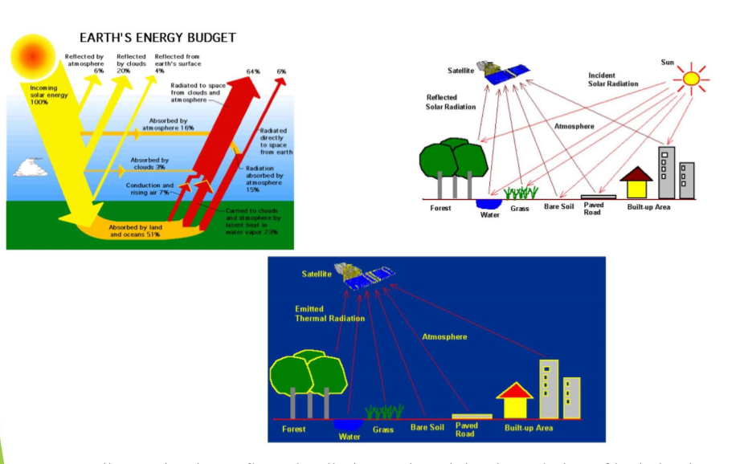
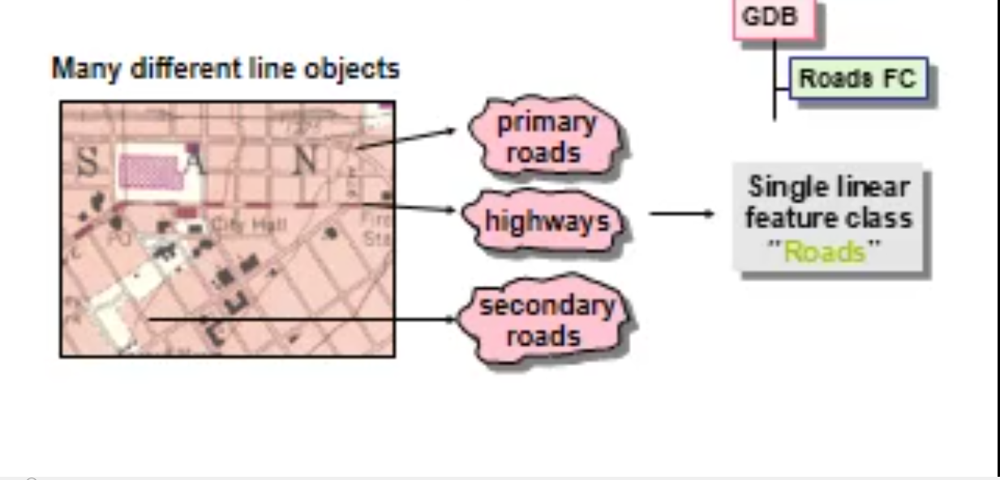
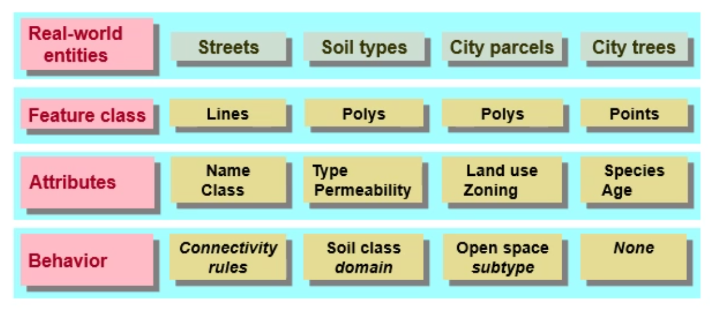

# GIS

> CBIS => spatially-referenced data, and the output of spatially-referenced information.

- Data : Any collection of **related facts**; the basic elements of information.
- Information : Data that have been processed to be useful; provides answers to "who", "what", "where", and "when" questions
  - Information can only **come from accurate data** (GIGO).

Also includes:

- •Data –both spatial and aspatial
- •Trained personnel
- •Supporting Institution
- •Protocols for use

## Whata is the GIS

> A geographic information system (GIS) is a computer-based tool for mapping and analyzing geographic phenomenon that exist, and events that occur, on Earth.

- GIS technology integrates common database operations such as query and statistical analysis with the **unique visualization** and geographic analysis benefits offered by maps.
- These abilities distinguish **GIS from other information systems** and make it **valuable** to a wide range of public and private enterprises for explaining events, predicting outcomes, and planning strategies.
- Map making and geographic analysis are _not new_, but a GIS performs these tasks **faster** and with more **sophistication** than do traditional manual methods.

- Overall, GIS should be viewed as a technology, not simply as a computer system.
- In general, a GIS provides facilities for **data capture**, **data management**, **data manipulation and analysis**, and the **presentation** of results in both **graphic and report form**, with a particular emphasis upon preserving and utilizing inherent characteristics of spatial data.
- The ability to incorporate spatial data, manage it, analyze it, and answer **spatial questions** is the distinctive characteristic of geographic information systems.

## What are the five components of a GIS

- People: computer stuff, such as, experts, GIS operators, GIS experts, application developers.
- Data: may be spatial, attribute, temporal data.
- Hardware: including hard disks, computers, GPS, disks, digitizer, - plotters, and communication devices.
- Software: operating systems, ARC GIS, ARC VIEW, ARC INFO, or any CAD software.
- Mehods or Procedures or Analysis: queries and the required tasks user needs or asks the GIS system about its answers.
  - help GIS to operate according to a well-designed implementation plan and business rules, which are the models and operating practices unique to each organization

### GIS Data Model

- A GIS stores information about the world as a collection of thematic layers that can be linked together by geography.
- This simple concept has proven valuable for solving many real-world problems from tracking delivery vehicles to modeling global atmospheric circulation.
- The thematic layer approach allows us to organize the complexity of the real world into a **simple representation** to help facilitate our understanding of natural relationships

## The Power of GIS

- The interaction between the **database** and the **map**, along with the ability to create graphs, tables and reports.

> GIS allows us to **_abstract information_** from the **physical** world and display it in **layers or themes**. It allows us to:

- • Input and edit both **spatial and attribute** data.
- • Display data on a screen or print a map.
- • Analyze the data for making decisions and searching for patterns.
- • Create models and ask “what if”
  - Where are particular features found?
  - What geographic patterns exist?
  - Where have changes occurred over a specified time period?
  - Where do certain conditions apply?
  - What will be the implications if an organization takes a certain action

## What is the meaning of Georeferancing

- the process of converting from **system coordinate (x, y)** to **real-world coor** **_using control points_** (establishing a relation between the data displayed in the GIS software and real world coordinates)

## What types of data are used in a GIS

- Coordinate data
- Connection information
- Descriptive information
- Temporal information
- Images
- Documents
- URL’s

## How is spatial data represented in a GIS

- Vectors
  - Points, Lines & Areas/Polygons
- Raster
  - Grids/Tesselations

## GIS Subsystems

- Data Input
  - Capture , collect and transform spatial and thematic data into digital form.
  - The data inputs are usually derived from a **combination of hard copy maps**, **aerial photographs**, **remotely sensed images**, reports, survey documents, etc.
- Data Storage and retrieval
  - Text , Music , Video , Imagery , Remote Sensing Data,
  - subsystem organizes the data, spatial and attribute, in a form which permits it to be **quickly retrieved** by the user for _analysis_, and permits **rapid and accurate** updates to be made to the database.
  - This component usually involves use of a **_database management system (DBMS)_** for maintaining attribute data.
- Data Manibulation and analysis
  - allows the user to define and execute **spatial and attribute procedures** to generate **_derived information_**
- Data output and display => Representation
  - allows the user to **generate** graphic displays, normally maps, and tabular reports representing derived information products.

> It is important to understand that the GIS is not a new invention. In fact, geographic information processing has a **rich history** in a variety of disciplines.

---

> Today's generic, geographic information system, is distinguished from the geo-processing of the past by the use of computer automation to integrate geographic data processing tools in a friendly and comprehensive environment.

## GIS Technology Utilize 2 types of data

- Spatial Data
  - Coordinates (Longitude m=, Latitude )x,y
  - Which describes the absolute and relative location of geographic features.
  - Three basic types of spatial data models have evolved for storing geographic data digitally. These are referred to as:  Vector  Raster  Image
  - Vector formats  Discrete representations of reality
    - Lines , Polygons , Points
  - Raster formats  Use square cells to model reality
    - Areas broken into ‘pixels’ or cells Each cell contains data  Good at representing  **dense data**  **land cover**  **Elevation**
- Attribute Data => Tabular Data
  - Sonmething about the place Characterstics of Spatial Data (name , population ,.)
  - which describes characteristics of the spatial features. These characteristics can be quantitative and/or qualitative in nature.
  - These characteristics can be quantitative and/or qualitative in nature.
  - Attribute data is often referred to as tabular data.
- Other data types, in particular image and multimedia data, are becoming more prevalent with changing technology.
- Depending on the specific content of the data, image data may be considered either spatial, e.g. photographs, animation, movies, etc., or attribute, e.g. sound, descriptions, narration's, etc.

> Spatial data is usually in analog form and we need to degitize it

### Spatial Data

- Automatic Digitizing
- Handled with mouse => Hand Traced with mouse

### {Aspetial Data} Attribute Data

- Many Sources (Text,Images , ......)

> attribute data ususally input by manual **keying or bulk loading**

### Compare between Spatial data && Aspatial data

- Spatial data: represents features that have a known location on earth, such as, a hospital building
- Aspatial data (attribute data): the information linked to the geographic features (spatial data) that describe these features, such as, the hospital name, number of doctors and nurses worked in this hospital.

## Image Data Type

- Image data is most often used to represent **graphic or pictorial data**.
- Most often, image data is used to store **remotely sensed imagery**, e.g. satellite scenes or orthophotos, or ancillary graphics such as photographs, scanned plan documents, etc.
- Image data is typically used in GIS systems as **background display data**.
- Typically, this data must be converted **into a raster format** (and perhaps vector) to be used analytically with the GIS.

## Attribute data Model

- A **separate** data model is used to store and maintain attribute data for GIS software.
- These data models may exist internally within the GIS software, or may be reflected in external commercial Database Management Software (DBMS).
- A variety of different data models exist for the storage and management of attribute data. The most common are:  **Tabular**  **Hierarchial**  **Network**  **Relational**  **Object_oriented**

- Connecting spatial with attribute data
  - Single feature class
  - Attributes stored in dBASE table

## Data Storage and Retrieval Component

- Usually use DBMS to ease use of retrieval of data for analysis
- Spatial Data is Usuually encoded and maintained in **Propreitary file format**
- Organizing data in thematic approach => **Vertical Layers**
- interactive editing for Both **Spatial and Attribute Data**
- Crud operations to both (simulitnaously or independently)
- Ability to edit selected features in **batch-Processing mode**

## Data Retrieval and Querying

- DBMS has a unique structure to retrieve data
- In addition to the GIS system has a **Programming ubroutine library** => Macro Language
- Usually Data subsets is base on **userdefined formula** => Logical Views

## Data Manipulation and analysis

- Ususally we need to define and execute some spatial and attribute data procedures to derieve information
- **Heart** componet of GIS, and which diffrentiate it from DBMSs and CAD

### Manipulation and Transformation

- ability to input , manipulate , transform data once it has been created

---

## Lecture 3: GIS DATA Sources

## GIS Data Sources

- The data input process is the operation of encoding both types of data into the GIS database formats.
- The creation of a clean digital database is the **most important and timeconsuming** task upon which the usefulness of the GIS depends.
- The **establishment and maintenance** of a robust spatial database is the cornerstone of a successful GIS implementation.
- As well, the digital data is **the most expensive part** of the GIS.
- Yet often, not enough attention is given to the quality of the data or the processes by which they are prepared for automation.

## Spatial Data Sources

- The general consensus among the GIS community is that 60 to 80 % of the cost incurred during implementation of GIS technology lies in **data acquisition**, **data compilation and database development**.
- A wide variety of data sources exist for both spatial and attribute data.
- The most common general sources for spatial data are: • **Hard copy maps** • **Aerial photography** • **Remotely sensed images** • Point data samples from a survey • Existing digital data file.

- Existing hard copy maps, e.g. sometimes referred to as **analogue maps**, provide the **most popular source for any GIS** project.
- Potential users should be aware that while there are many private sector firms specializing in providing digital data, federal, provincial and state government agencies are an excellent source of data.
- Because of the large costs associated with data capture and input, government departments are often the only agencies with financial resources and manpower funding to invest in data compilation.
- Federal agencies are also often a good source for base map information.
- An inherent advantage of digital data from government agencies is its cost.
- It is typically inexpensive. However, this is often offset by the data's accuracy and quality.  Thematic coverages are often not up to date.

## Attribute Data Sources

- Attribute data has an even wider variety of data sources.
- Any textual or tabular data than can be referenced to a geographic feature, e.g. a point, line, or area, can be input into a GIS.
- Attribute data is usually input by **manual keying or via a bulk loading** utility of the DBMS software.  **ASCII format** is a de facto standard for the transfer and conversion of attribute information

## Data Input Techniques

- Since the input of attribute data is usually quite simple, the discussion of data input techniques will be limited to spatial data only.
- There is **no single** method of entering the spatial data into a GIS. Rather, there are several, mutually compatible methods that can be used singly or in combination.
- The choice of data input method is **governed largely by the application**, the available budget, and the type and the complexity of data being input.
- There are at least four basic procedures for inputting spatial data into a GIS. These are:
  - Manual digitizing
  - Automatic scanning
  - Entry of coordinates using coordinate geometry
  - Conversion of existing digital data

## Digitizing

- While considerable work has been done with newer technologies, the overwhelming majority of GIS spatial data entry is **done by manual digitizing**.
- A digitizer is an electronic device consisting of a table upon which the map or drawing is placed.
- The user traces the spatial features with a hand-held magnetic pen, often called a mouse or cursor.
- While tracing the features the coordinates of selected points, e.g. vertices, are sent to the computer and stored.
- All points that are recorded are registered against positional control points, usually the map corners, that are keyed in by the user at the beginning of the digitizing session.
- The coordinates are recorded in a user defined coordinate system or map projection.  Latitude and longitude is most often used.

### Advantages of Manual Digitizing

- Low capital cost, e.g. digitizing tables are cheap; • Low cost of labour;
- Flexibility and adaptability to different data types and sources;
- Easily taught in a short amount of time - an easily mastered skill
- Generally the quality of data is high;
- Digitizing devices are very reliable and most often offer a greater precision that the data warrants; and
- Ability to easily register and update existing data.

### Digitizing Raster Data

- For raster based GIS software data is still commonly digitized in a vector format and converted to a raster structure.
- The procedure usually differs minimally from vector based software digitizing, other than some raster systems allow the user to define the resolution size of the grid-cell.
- Conversion to the raster structure may occur on-the-fly or afterwards as a separate conversion process.

## Automatic Scanning

- A variety of scanning devices exist for the automatic capture of spatial data.
  -While several different technical approaches exist in scanning technology, all have the advantage of being able to capture spatial features from a map at a rapid rate of speed.
- However, as of yet, scanning has not proven to be a viable alternative for most GIS implementation.
- Scanners are generally expensive to acquire and operate. As well, most scanning devices have limitations with respect to the capture of selected features, e.g. text and symbol recognition.
- Experience has shown that most scanned data requires a substantial amount of manual editing to create a clean data layer.

### Given these basic constraints some other practical limitations of scanners should be identified

- hard copy maps are often unable to be removed to where a scanning device is available, e.g. most companies or agencies cannot afford their own scanning device and therefore must send their maps to a private firm for scanning;
- hard copy data may not be in a form that is viable for effective scanning, e.g. maps are of poor quality, or are in poor condition;
- geographic features may be too few on a single map to make it practical, cost-justifiable, to scan;
- often on busy maps a scanner may be unable to distinguish the features to be captured from the surrounding graphic information, e.g. dense contours with labels; - scanning is much more expensive than manual digitizing, considering all the cost/performance issues.

## Special Data Models

- Consensus within the GIS community indicates that scanners work best when the information on a map is kept **very clean**, **very simple, and uncluttered** with graphic symbology.
- The **sheer cost** of scanning usually eliminates the possibility of using scanning methods for data capture in most GIS implementations. Large data capture shops and government agencies are those most likely to be using scanning technology.
- Currently, general consensus is that the quality of data captured from scanning devices is not substantial enough to justify the cost of using scanning technology. However, major breakthroughs are being made in the field, with scanning techniques and with capabilities to automatically clean and prepare scanned data for topological encoding.
- These include a variety of line following and text recognition techniques. Users should be aware that this technology has great potential in the years to come, particularly for larger GIS installations.

## Coordinate Geometry

- A **third technique for the input** of spatial data involves the _calculation and entry of coordinates_ using **coordinate geometry (COGO) procedures**.
- This involves entering, from **survey data, the explicit measurement** of features from some known monument.
- This input technique is obviously very **costly and labour intensive**.
- In fact, it is rarely used for natural resource applications in GIS.
- This method is useful for creating **very precise cartographic definitions** of property, and accordingly is more appropriate for land records management.
  Conversion of Existing Digital Data

> A fourth technique that is becoming increasingly popular for data input is the conversion of existing digital data.

- A variety of spatial data, including digital maps, are openly available from a wide range of government and private sources.
- The most common digital data to be used in a GIS is data from **CAD systems**.
- A number of data conversion programs exist, mostly from GIS software vendors, to transform data from **CAD formats to a raster or topological GIS** data format.
- Most GIS software vendors also provide an **ASCII data exchange format** specific to their product, and a programming subroutine library that will allow users to write their own data conversion routines to fulfil their own specific needs.
- As digital data becomes more readily available this capability becomes a necessity for any GIS.
- Data conversion from existing digital data is not a problem for most technical persons in the GIS field.  However, for smaller GIS installations who have limited access to a GIS analyst this can be a major stumbling block in getting a GIS operational.

## Data Editing and Quality Assurance

- Data editing and verification is in response to the errors that arise during the encoding of spatial and non-spatial data.
- The editing of spatial data is a time consuming, interactive process that can take as long, if not longer, than the data input process itself.
- Several kinds of errors can occur during data input.
- They can be classified as:

  - Incompleteness of the spatial data. This includes missing points, line segments, and/or polygons.
  - Locational placement errors of spatial data. These types of errors usually are the result of **careless digitizing or poor quality** of the original data source.
  - **Distortion** of the spatial data. This kind of error is usually caused by _base maps_ that are not **scale-correct** over the whole image, e.g. aerial photographs, or from material stretch, e.g. paper documents.
  - **Incorrect linkages** between spatial and attribute data. This type of error is commonly the result of **incorrect unique identifiers** {FID} (labels) being assigned during manual key in or digitizing. This may involve the assigning of an entirely wrong label to a feature, or more than one label being assigned to a feature.
  - Attribute data **is wrong or incomplete**. Often the attribute data does not match exactly with the spatial data. This is because they are **frequently from independent sources** and often different time periods. Missing data records or too many data records are the most common problems.

  - The **identification of errors** in spatial and attribute data is often difficult.
  - Most spatial errors become **evident** during the **topological building process**.
  - The use of **check plots** to clearly determine where spatial errors exist is a common practice. Most topological building functions in GIS software clearly identify the geographic location of the error and indicate the nature of the problem.
  - **Comprehensive** GIS software allows users to graphically walk through and edit the spatial errors.
  - Others merely identify the type and coordinates of the error. Since this is often a labour intensive and time consuming process, users should consider the error correction capabilities very important during the evaluation of GIS software offerings.

### Spatial Data Errors

- A variety of common data problems occur in converting data into a topological structure.
- Usually data is input by **digitizing**.
- Digitizing allows a user to **trace spatial data** from a hard copy product, e.g. a map, and have it recorded by the computer software.
- Most GIS software has utilities to clean the data and build a topologic structure.
- If the data is unclean to start with, for whatever reason, the cleaning process can be very lengthy. Interactive editing of data is a distinct reality in the data input process.
- Experience indicates that in the course of any GIS project 60 to 80 % of the time required to complete the project is involved in the input, cleaning, linking, and verification of the data.
- The most common problems that occur in converting data into a topological structure include:

  - gaps in the line work;
  - dead ends, e.g. also called **dangling arcs**, resulting from **overshoots** and **undershoots** in the line work; and
  - bow ties or weird polygons from inappropriate closing of connecting features

### Image Data _Type_

- Of course, topological errors only exist with **linear and areal features**.
- They become most evident with polygonal features. Slivers are the most common
- problem when cleaning data.

  - **Slivers** frequently occur when **coincident boundaries are digitized** separately, e.g. once each for adjacent forest stands, once for a lake and once for the stand boundary, or after **polygon overlay**.
  - Slivers often appear when combining data from different sources, e.g. forest inventory, soils, and hydrography.
  - It is advisable to digitize data layers with respect to an **existing data layer**, e.g. hydrography, rather than attempting to match data layers later.
  - A proper plan and definition of priorities for inputting data layers will save many hours of interactive editing and cleaning.
  - **Dead ends** usually occur when data has been digitized in a **spaghetti mode**, or without **snapping to existing nodes**.
  - Most GIS software will clean up **undershoots and overshoots** based on a user defined tolerance, e.g. distance.
  - The definition of an inappropriate distance often leads to the formation of **bow ties or weird polygons** during topological building.
  - **Tolerances** that are too large will force arcs to snap one another that should not be connected.
    - result is small polygons called **bow ties**.
  - The definition of a proper tolerance for cleaning requires an understanding of the scale and accuracy of the data set.
  - The other problem that commonly occurs when building a topologic data structure is **duplicate lines**.
    - These usually occur when data has been digitized or converted from a CAD system.
    - The lack of topology in these type of drafting systems permits the inadvertent creation of elements that are exactly duplicate. However, most GIS packages afford automatic elimination of duplicate elements during the topological building process.
    - Accordingly, it may not be a concern with vector based GIS software. Users should be aware of the duplicate element that retraces itself, e.g.
    - a three vertice line where the first point is also the last point.
    - Some GIS packages do not identify these feature inconsistencies and will build such a feature as a **valid polygon**.
    - This is because the topological definition is mathematically correct, however it is not geographically correct.
    - Most GIS software will provide the capability to eliminate **bow ties** and slivers by means of a feature elimination command based on area, e.g. polygons less than 100 square metres.
    - The ability to define custom topological error scenarios and provide for semiautomated correction is a desirable capability for GIS software.

## Attribute data Errors

- The identification of attribute data errors is usually not as simple as spatial errors.
- This is especially true if these errors are attributed to the quality or reliability of the data.
- Errors as such usually do not surface until later on in the GIS processing.
- Solutions to these type of problems are much more complex and often do not exist entirely.
- It is much more difficult to spot errors in attribute data when the values are syntactically good, but incorrect.
- Simple errors of linkage, e.g. missing or duplicate records, become evident during the linking operation between spatial and attribute data.
- Again, most GIS software contains functions that check for and clearly identify problems of linkage during attempted operations.  This is also an area of consideration when evaluating GIS software.

## Data Verification

- Six clear steps stand out in the data editing and verification process for spatial data.
  - __Visual review__. This is usually by check plotting.
  - __Cleanup of lines and junctions__. This process is usually done by software first and interactive editing second.
  - __Weeding of excess coordinates__. This process involves the removal of redundant vertices by the software for linear and/or polygonal features.
  - __Correction for distortion and warping__. Most GIS software has functions for scale correction and rubber sheeting. However, the distinct rubber sheet algorithm used will vary depending on the spatial data model, vector or raster, employed by the GIS. Some raster techniques may be more intensive than vector based algorithms.
  - __Construction of polygons__. Since the majority of data used in GIS is polygonal, the construction of polygon features from lines/arcs is necessary. Usually this is done in conjunction with the topological building process.
  - __The addition of unique identifiers__ or labels. Often this process is manual. However, some systems do provide the capability to automatically build labels for a data layer.

> These data verification steps occur after the data input stage and prior to or during the linkage of the spatial data to the attributes.  Data verification ensures the integrity between the spatial and attribute data.  Verification should include some brief querying of attributes and cross checking against known values.

---

## Lecture 5: Remote Sensing and GIS

- Any location on the earth has **massive amounts of data** tied to it, which not only include physical features, but political, economic and social data, as well.
- GIS facilitates the process by which we can **visualize**, **analyze** and **understand** this data.
- **_Remote sensing_** is one of the **methods** commonly used for collecting **physical data** to be integrated into GIS.
- **_Remote sensors_** collect data from objects on the earth without any **direct contact**.
- They do this by detecting **_energy reflected from the earth_**, and are typically mounted on satellites or aircraft.
- **_Remote sensing technology_** has become much more **prevalent**, **accurate** and **accessible** in recent years, and covers a wide range of engineering applications.
- Remote sensing is an art and science of obtaining information about an object or feature without physically coming in contact with that object or feature.
- These remotely collected data through various sensors may be analysed to obtain information about the objects or features under investigation.
- remote sensing is the process of inferring surface parameters from measurements of the **_electromagnetic radiation (EMR)_** from the Earth‘s surface.
- This EMR can either be reflected or emitted from the **Earth‘s surface**.
- In other words, remote sensing is detecting and measuring electromagnetic (EM) energy **emitted or reflected** from distant objects made of various materials, so that we can identify and categorize these objects by class or type, substance and spatial distribution.
  

- By recording emitted or reflected radiation and applying knowledge of its _behavior_ as it passes through the Earth’s atmosphere and interacts with objects, remote sensing analysts develop knowledge of the **_character of features_** such as **vegetation, structures, soils, rock, or water** bodies on the Earth’s surface.

### basic concepts of Remote Sensing

- Electromagnetic energy or electromagnetic radiation (EMR) is the energy propagated in the form of an advancing interaction between electric and magnetic fields.
- It travels with the **velocity of light**. Visible light, ultraviolet rays, infrared rays, heat, radio waves, X-rays all are different forms of electro-magnetic energy.
- Electro-magnetic energy (E) can be expressed either in terms of **frequency** (f) or **wave length** (λ) of radiation as $$E = h c f$$ or $$E=h c / λ$$
- where h is **Planck's constant** `(6.626 x 10-34 Joules-sec)`, c is a constant that expresses the celerity or speed of light (3 x 108 m/sec), f is frequency expressed in Hertz and λ is the wavelength expressed in micro meters (1μm = 10-6 m).

- As can be observed from this equation, **shorter wavelengths** _have higher energy_ content and **longer wavelengths have lower energy content**.
- Distribution of the **continuum of energy** can be plotted as a function of wavelength (or frequency) and is known as the EMR spectrum
- All matters reflect, emit or radiate a range of electromagnetic energy, depending upon the **_material characteristics_**.
- In remote sensing, it is the measurement of electromagnetic radiation reflected or emitted from an object, is the used to identify the target and to infer its properties.

### Principles of Remote Sensing

- Different objects reflect or emit **different amounts of energy** in different bands of the electromagnetic spectrum.
- The amount of energy reflected or emitted depends on the **properties** of both the material and the **incident energy** (angle of incidence, intensity and wavelength).
- Detection and discrimination of objects or surface features is done through the uniqueness of the reflected or emitted electromagnetic radiation from the object.
- Adevice to detect this reflected or emitted electro-magnetic radiation from an object is called a **―sensor** (e.g., cameras and scanners).
  A vehicle used to carry the sensor is called a **―platform** (e.g., _aircrafts_ and _satellites_).

### Main stages of Remote Sensing

- Emission of electromagnetic radiation: The Sun or an EMR source located on the **platform**
- Transmission of energy from the source to the object: Absorption and **scattering** of the EMR while transmission '
- Interaction of EMR with the object and subsequent reflection and emission: Transmission of energy from the object to the sensor
- Recording of energy by the sensor : Photographic or nonphotographic sensors - Transmission of the recorded information to the ground station
- Processing of the data into digital or hard copy image
- Analysis of data

### Passive and Active Remote Sensing

- Depending on the source of electromagnetic energy, remote sensing can be classified as **passive or active** remote sensing.
- In the case of **passive remote sensing**, source of energy is that naturally available such as the Sun.
- Most of the remote sensing systems work in **passive mode** using **solar energy** as the source of EMR.
- Solar energy reflected by the targets at specific wavelength bands are recorded using sensors on board **air-borne or space borne platforms**.
- In order to ensure that signal strength received at the sensor, wavelength / energy bands capable of traversing through the atmosphere, without significant loss through atmospheric interactions, are generally used in remote sensing.
- In the case of **active remote sensing**, energy is generated and sent from the **remote sensing platform** towards the targets.
- The energy reflected back from the targets are recorded using sensors on board the remote sensing platform.
- Most of the **microwave remote sensing** is done through active remote sensing.
- As a simple analogy, passive remote sensing is similar to taking a picture with an ordinary camera whereas active remote sensing is analogous to taking a picture with camera having **built-in flash**

### The Difference Between Remote Sensing and GIS

- Remote Sensing:
  - It is a **surveying** and **data collection** technique.
  - It can retrieve **large amounts of data**.
  - It reduces **manual field** work dramatically.
  - It allows retrieval of data in regions **difficult or impossible to access**.
  - It allows collection of more data in a short period of time.
  - Mostly use in data collection.
  - Has a **more complex user interface** .
  - It covers **a limited study area** at a time.
  - **Less ideal** for communicating information between departments.
- GIS
  - It is a computer system consisting of hardware and software.
  - It can cope with larger amounts of data.
  - It can cover large study areas.
  - It can cope with unlimited and frequent data edits.
  - More robust and resistant to damage.
  - Faster and more efficient.
  - It requires less person, time and money.
  - Mostly used for data analysis.
  - Has a more **simplified** user interface.
  - Is **an ideal tool for communication** between different departments.

### Advantages of remote sensing are

- Provides data of large areas
- Provides data of very remote and inaccessible regions
- Able to obtain imagery of any area over a continuous period of time
  -Relatively inexpensive when compared to employing a team of surveyors
- Easy and rapid collection of data
- Rapid production of maps for interpretation

### Disadvantages of remote sensing are

- The interpretation of imagery requires a certain skill level
- Needs cross verification with ground (field) survey data
- Data from multiple sources may create confusion
- Objects can be misclassified or confused
- Distortions may occur in an image due to the relative motion of sensor and source

---

## Lecture 6 Data Formats

### Representing Geographic features

- Raster => Grid Based
- Vector => Points, Polylines, Polygons
- Date Geometric => Shape file and associate the data with attributes and Behavior rules

### Introducing Feature Classes == Layers

- Collection of features with the same type of Geometery
- Point or line or polygon feature classes
- 
- Geodatabase is container of Different Feature Datasets which is a container to classes of features
- Datasets that can be in teh Geodatabase
  - File GeoDatabase as folder of files => 1TB
  - Personal GeoDatabase as file => 2 GB
  - ArcSDE or Arc Spatial Data Engine => MultiUser => unlimited to a size => Relational Database

### Linking Features and Attributes

- The FID => Feature Identifier is a way to associate
- Feature Class => is a table Used to store spatial data
- Each row is a feature contains FID

### Spatial Data Formats

- Raster
- CAD
- Shape File
  - 2 files based {.SHAPE for Shape Geometery, .dpf for codes and data}
- Coverage
  - Topological based, can contain many class of features, adjecant based
  - Extensions {AAT Arc Attribute Table, NAT Node Attribute Table, PAT Point or Polygons}
  - Attributes stored in **INFO** Table
- GEODATABASE
  - Stores Spatial data and their attributes in the Same RDBMS
  - Allow us to Analyze the work
  - Spatial Validation
    - If it to test the Network objects or object and the adjecant relationships
    - Geometric Network
    - Topology
  - Attribte Validation
    - Relationship classes
    - Domain
    - Subtype
- Internet MAP Service IMS => Costable
- Tables

## Lecture 8 Project Design

- Defining phases for work in GIS
- System Analyst or Designer collecting Requirements of a GIS Project in start by interviews .....
  - Defining the Specific area to Work ,, Where?
  - Choose Equipments and which data needed , Teamwork, Source of Data?
  - What are the features and which layers needed?
  - Data colectivity must be specified

### Typical GIS Project => 6 months

- Project Design
- Data Design
- Data Input => 4 months
- Analysis => 2 weeks
- Reporting & presentation => 2 weeks

> Too Much time for data entery

### Project Design

- The Project can be organized as a series of logical steps each of which builds upon the previous one

### Build the Database

- Most Critical and Most Consuming Time
- The Completeness and the accuracy of DB determines the quaity of the analysus and final product
- Steps:
  - 1.(a)
    - Determine the Area Bounadaries
    - What is the Coordinate system will be used?
    - which data layers or coverages?
    - What features are for each layer?
    - What are the attributes for each feature?
    - How can the attributes be coded or designed?
  - 2.(b) Automation the data => 3 steps
    - Get the spatial datainto the database by digitizing it - Make the spatila data usable.
    - Get the attribute data then associate it with spacial data

> Coverage joins many features, Layer has one feature

### Database Management

- put the database into geographic coordinate system
- Join adjecant areasinto databases or split large databases into **TILES**

> Tiles are physical subsets of a larger geographic area which contain identical themes

### Analyze the Data

- The Value of GIS is Shines here which are otherwise extremely time-consuming
- Alternative scenarios can also be tested by making **minor** revisions in the analytical method

### Present the result of the Analysis

### Designing the Database

- Identifying the geographic features and their attributes
- Organize data layers
  - 2 of most common considerations here are **Features Types** {lines , points , polygons}, **Thematic grouping of features**
  - To Build the database , We need to specify the **Data Source** Then The **Data layers**
  - Data Modeling => what are the Features? and what is the type? what is the Attributes related?
    - Buildings => points => {Populations, Number of Layers}
    - Gas Pipes => Lines
    - Road Surfaces

## Lecture 10 Data Automation

### Phases

- Planning
  - Requierments Specification
- **_Data Automation_**
  - Digitizing
- Setting Validation Rules
- Data Editing
  - Correcting Errors
- Spatial Adjustment
  - Linking Between spatial Data and attribute data
- Pilot study
  - Experimental test

### Database Design Procedures => Prototyping

- Needs Assesments {Planning}
  - What features and layers, objective , problems , what is a result, one project or more, Teamwork
  - Define Your Objectives
  - Decide what to Achieve ?? {Goals}
  - Ask the right people the right question
- Conceptual and logical design {Planning}
  - 2 Types => Spatial Data and Features Attribute and Coordinate system
  - Identify the geographic entities and attributes
  - save entities into feature classes
  - Organize them into thematic layer
- Physical design {Automation}
  - Phisycal architecture and type of DB , Documentation procedures
  - Determining the data storage format
- Automation Plan {Automation}
  - Linking
  - Many Spatial Data Automation Options
    - Paper Maps
      - Digitize {Shape file or coverage}
      - Scan {Raster} => then Vectorize => {Shape , Coverage , Feature Classes}
    - Import from files to GeoDatabase
- Pilot project {Automation}
  - testing
- Final implementation {Automation}

### Creating New Data

- Scanning Data
  - Produces Raster Images
  - Then to be usable we make GeoReferencing Based on Latitude and Longitude
- Table Digitizing
  - accuarate because it use vectoized,
  - Produce vector Feature classes
  - Georeferencing after or during tracing
- Heads Up Digitizing
  - On Screen Digitizing
  - Georeferencing after or before tracing

### Compare between Onscreen digitizing technique && Digitizing table

- Onscreen digitizing technique: is the process of **tracing** the features from a scanned map or an image to create a new layers or themes. In technique we use a **mouse and a monitor** rather than using a digitizer and table. This is **easier** than digitizing table and more accuracy .

- Digitizing table technique: is a **table** consist of a fine wire embedded on the surface of the table ready to be moved over the map, a digitizer by which we trace the map to digitize it. The digitizer have a function for every process button for recoding current x,y of the map, **button for capturing intersections between lines**, so on.

### Automation Plan Choose

- Data to Purchase
- Data to capture
- Data conversion and editing
- Data Aggregations

> Thematic layer versus original layer {Join in Feature class and the Attribute} ,Difference Thematic contain the Behavior
> 

### Compare between Dangle node && Pseudo node

- Dangle node: Arc endpoint that is not connected. There are two types of dangles:
  - Overshoot dangle node: node is covered its limit that is should to be.
  - Undershoot dangle node: node doesn't reached or achieved its limit.
- Pseudo node: a point on an arc that connects to itself. Normally, pseudo nodes are not considered as errors (in polygon layers)

### Compare between True node && Vertex

- True node: a point that represents an intersection of 3 or more arcs, also represent the start and end node of an arc
- Vertex: line intermediate points.

## Practical Annotations

- Identify Tool : used to display the **attribute** data of specified feature.
- Select Feature Tool : use to select a specified feature in a specified layer.
- Statistics Command : used to maintain some statistics about an attribute on the specified layer such as, maximum and minimum value for this attribute, summation of the all attribute values, there average and standard deviation value.
- Full Extent : Allows you to **zoom to the full extent** of your map.
- Select Elements : Allows you to select, resize, and move text, graphics, and other objects placed on the map.
- Zoom In in Data View : Allows you to zoom in to a **geographic window** by clicking a point or dragging a box.
- Zoom In in Layout View : Allows you to zoom in on your **layout** by clicking a point or dragging a box.
- Zoom Out : Allows you to zoom out from a geographic window by clicking a point or dragging a box.
- Pan : Allows you to pan the data frame.
- Fixed Zoom In : Allows you to zoom in **on the center** of your data frame.
- Fixed Zoom Out : Allows you to zoom out **on the center** of your data frame.
- Back : Allows you to go back to the previous extent.
- Forward : Allows you to go forward to the next extent.
- Clear Selection : Unselects all the currently selected features in the active data frame.
- Clip features: Use Clip when you want to **cut out a piece** of one layer using one or more of the polygons in another layer as a 'cookie cutter'. This is particularly useful for creating a new layer that contains a geographic subset of the features in another larger layer.
- Overly: there are two types of overlaying,
  - Intersect overlay: Use Intersect when you want to overlay a layer with the polygons in another layer so that the resulting output layer has the combined attribute data of the features in the two inputs, (a and b) only contains features that fall within the spatial extent of the overlay polygons.
  - Union overlay: Use Union when you want to overlay two polygon layers so that the resulting output layer has the combined attribute data of the polygons in the two inputs, (a and b) contains all the polygons from the inputs, whether or not they overlap. In this way, you can produce a new layer combining the features and attributes of two polygon layers.

### Compare between Georeferencing && Projection

- Georeferancing: the process of converting from system coordinate (x, y) to real-world coor using control points (establishing a relation between the data displayed in the GIS software and real world coordinates)
- Projection: the process of transforming from **2D (on screen) map to 3D curved surface** on the earth by specifying the geographic coordinate systems and projection coordinate systems.

## @AhmedKhalil contribution 2019/2020
