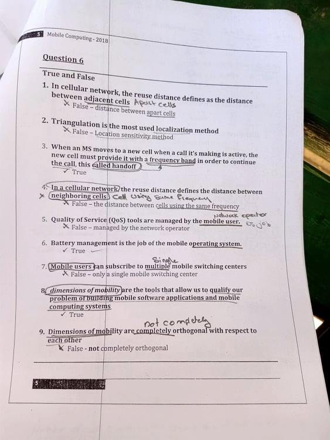
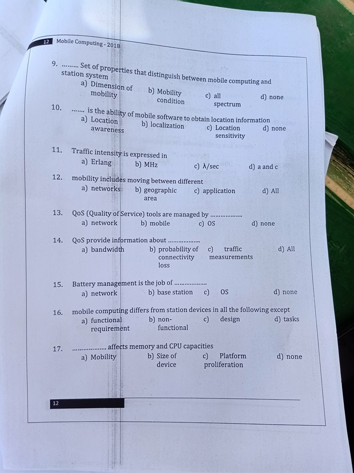
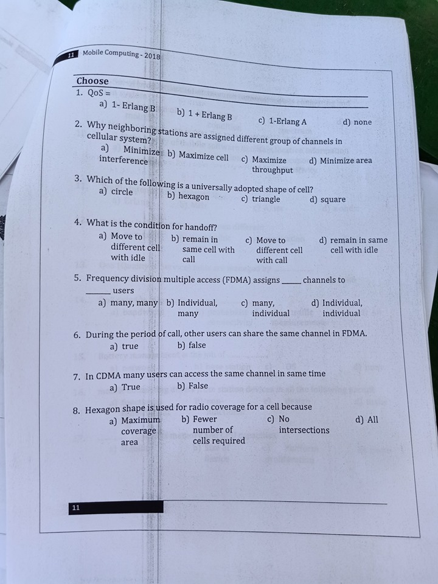
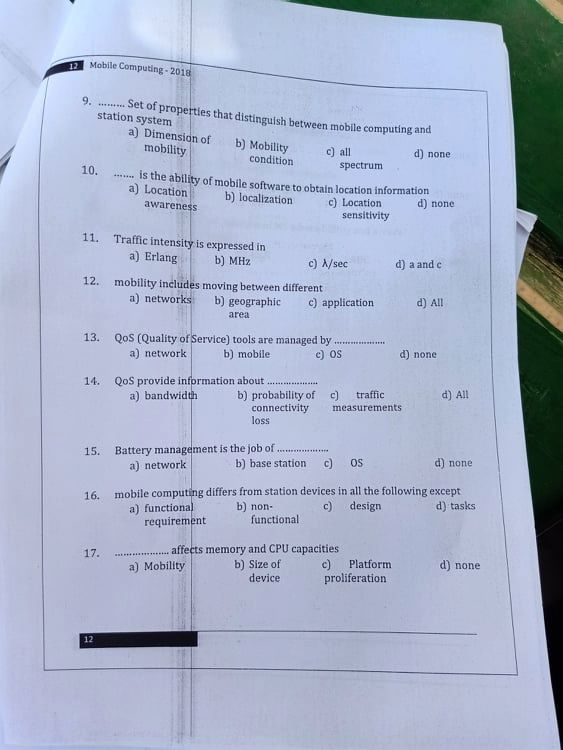

# In The Name of Allah 

## The Final Exam In Shaa AllAH Contents of Mobile Computing

## Map Of the Course

## Here I am gonna contribute In Shaa Allah

## This Course Is Indrotuced by Dr : Noha Hikal
### @AhmedKhalil contribution 2019/2020
