# In The Name of Allah 

## The Final Exam In Shaa AllAH Contents of Mobile Computing

## Map Of the Course

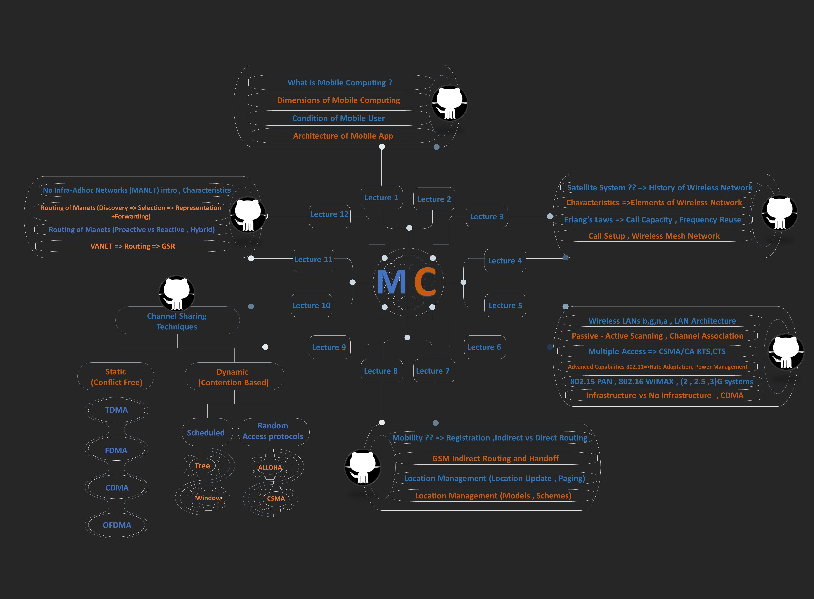

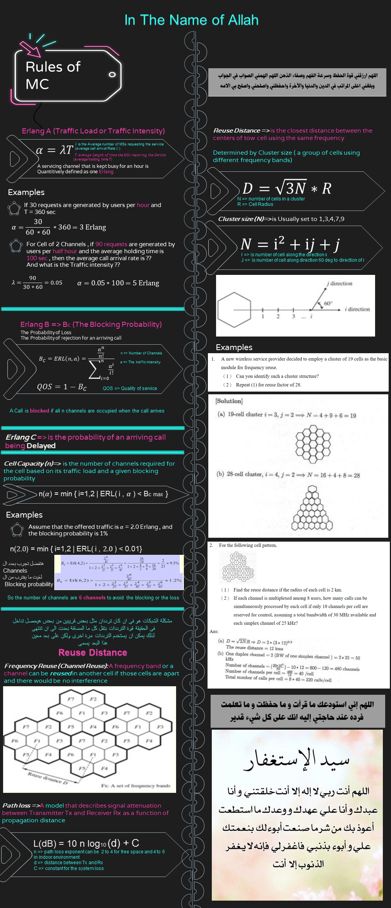


## The first image
<li> 1=> False Apart Cells<li> 2 => False (Location Sensetivity method)<li> 3=> True <li> 4 => False (the distance between cells have the same frequency => Clustering ) <li> 5 => False (managed by the network operator) <li> 6=> true <li> 7=> False (Single MSC)<li> 8=> True <li> 9=> False (Not Completely orthognal)

---

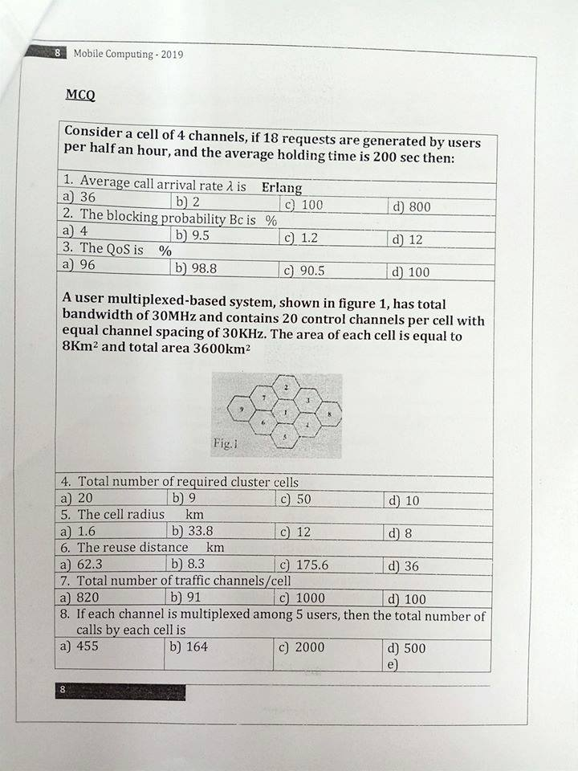

## The Second Pic 
```
السؤال الأول فيه غلطة مفروض يسأل عن ال 
Traffic intensity 
مش 
average arrival call 
```

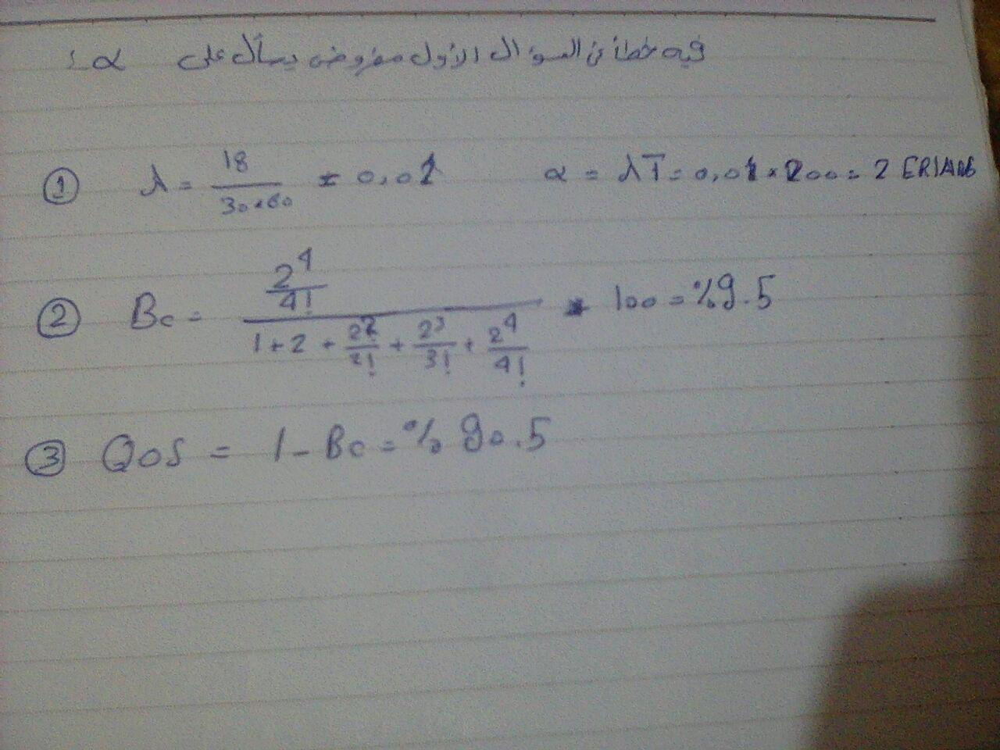

- 4 => Total number of required clusters = 9 cells/Cluster
- 5 => (The Area of Circle 2* PI * R) => Cell Radius = (Area / PI)^1/2 = (8 /3.14)^1/2 = 1.596 => 1.6 kM
- 6 => D = (3*N)^1/2 *R = (3 * 9)^0.5 * 1.6 = 8.3 KMs
- 7 => Total traffic Channels/Cell = 30000/30 - 20 * 9 =  820 channels
    - Traffic channels/cell = 820/9 = 91 channels/Cell
- 8 => # of Maximum calls ber cell = 91 *5 = 455 calls

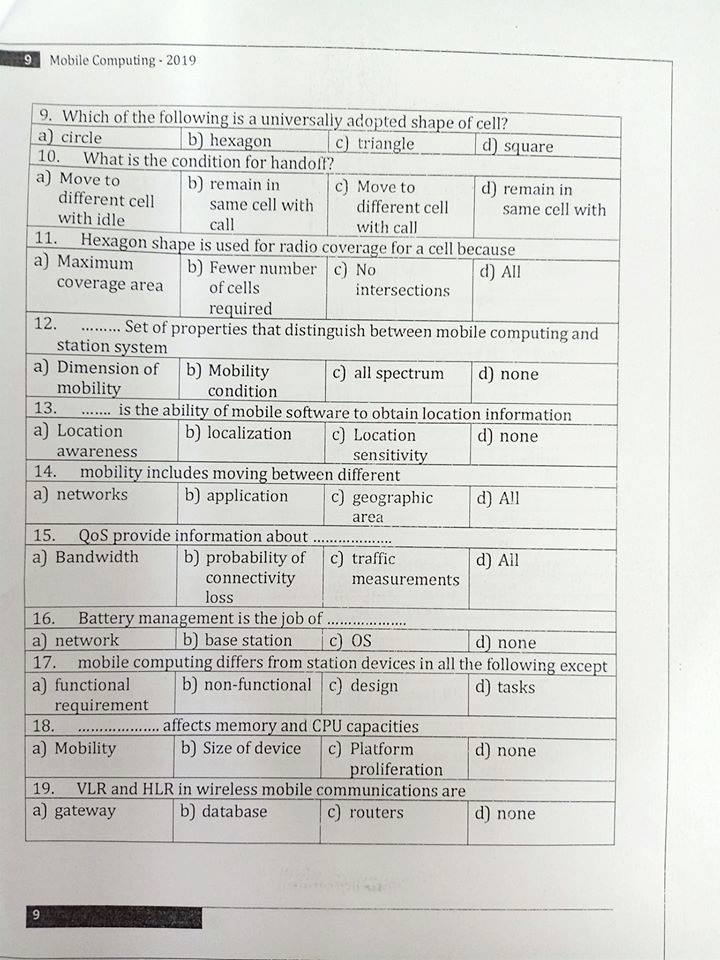

## The third image 
- 9 => Hexagon
- 10 => C -Move to different cell with call
- 11 => All
- 12 => Dimension of Mobility => Comparison between __systems__
- 13 => Location Sensitivity
- 14 => all
- 15 => all 
- 16 => OS
- 17 => non-functional
- 18 => Size of the device
- 19 => database
- 
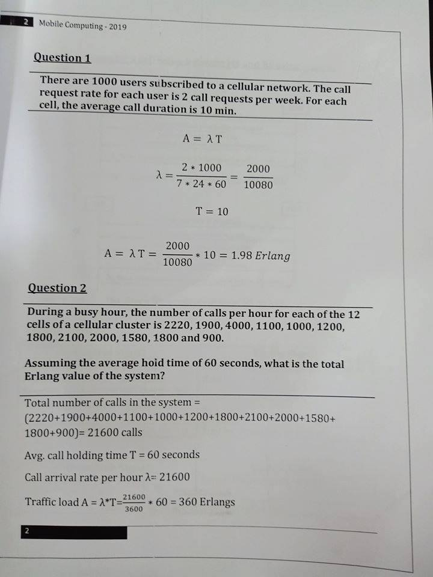

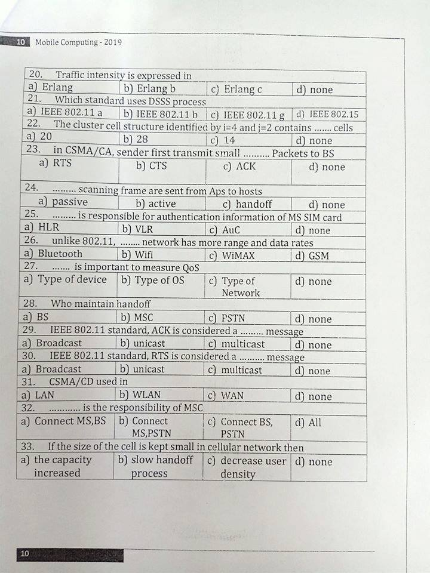

## The Fifth image
- 20 => Erlang 
- 21 => IEEE 802.11 __b__
- 22 => N = 16 +8 +4 =28 cell
- 23 => RTS
- 24 => Passive 
- 25 => AuC
- 26 => WIMAX
- 27 => Type of Network
- 28 => MSC
- 29 => Broadcast
- 30 => unicast => Infrastructure Model
- 31 => LAN
- 32 => Connect BS , PSTN
- 33 => The Capacity increased  => The size of the cells in cellular network is kept small because of the need of high capacity in areas with high user density and reduced size and cost of base station electronics.
  
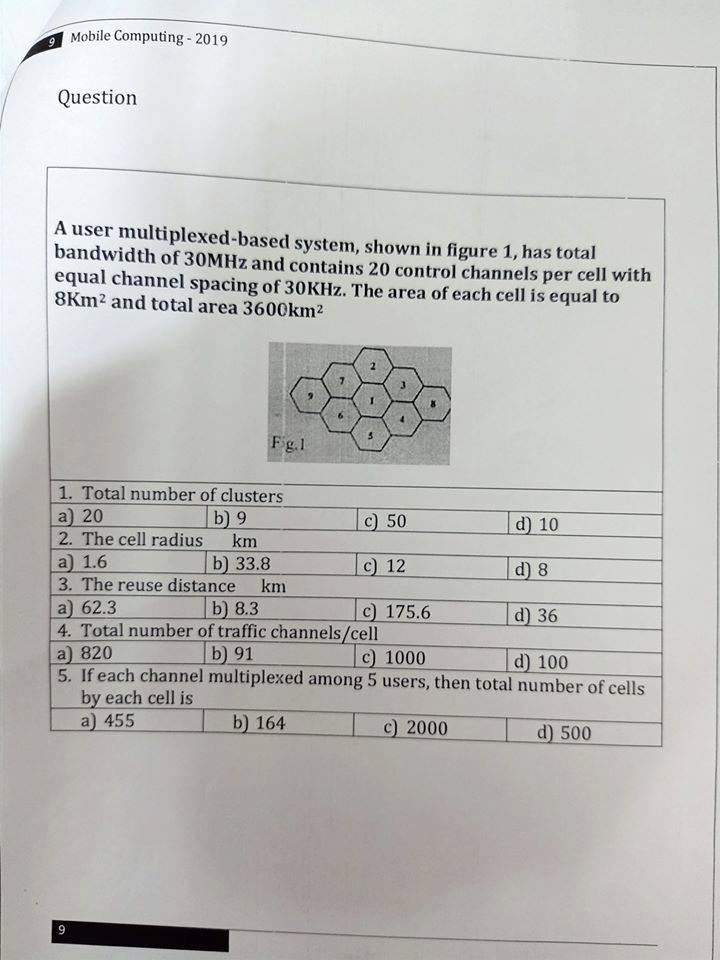

```
تم حلها فوق
```
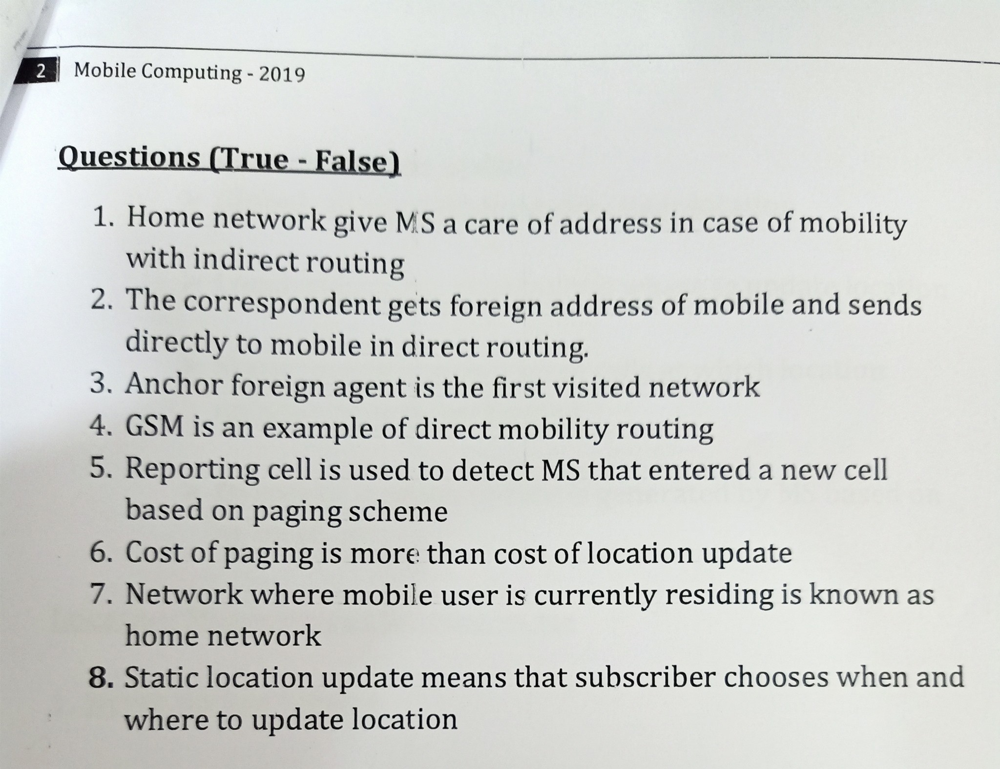

- 1 => True 
- 2 => True
- 3 => True 
- 4 => False => indirect routing to mobile
-  5=> True
- 6 => True  مش عارف الصح سؤال غريب
- 7=> False => Visited Network
- 8 => False Local Update


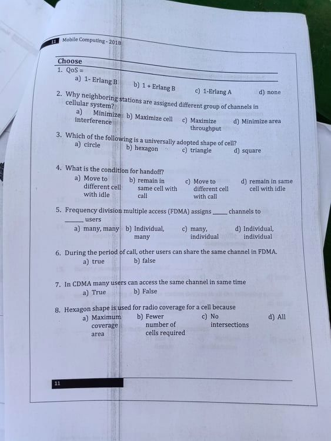

- 1 => 1 - Erlang B
- 2 => Minimize interference 
- 3 => hexagon
- 4=> Move to different cell with a call
- 5 => Individual to Individual =>The Frequency band is divided into many channels Each channel is assigned to only a user
- 6 => False  not functioned in the FDMA model
- 7 => True
- 8 => All

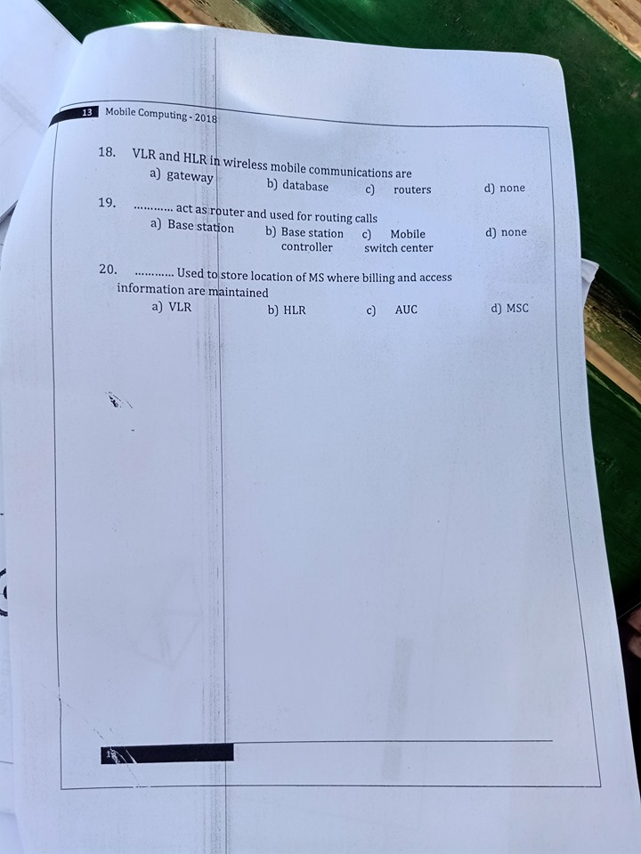

- 18 => Database\
- 19 => Mobile switching center
- 20 => HLR

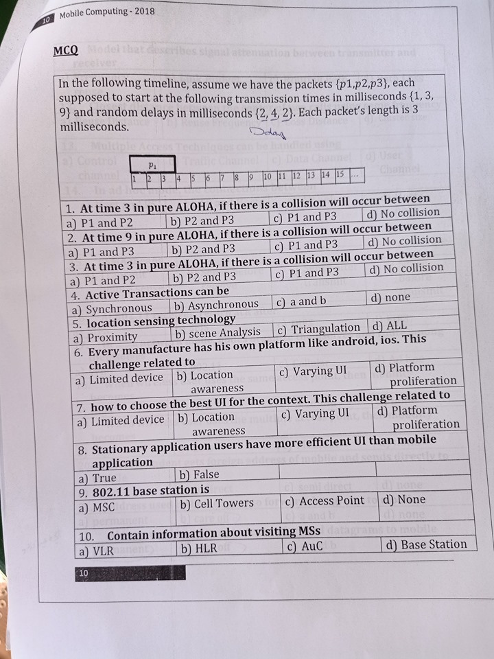

- 1=> P1 , P2
- 2 => P2 ,P3
- 4 => C
- 5 => All
- 6 => Platform Proliferation
- 7 => Varying UI
- 8 => True
- 9 => Access Point
- VLR

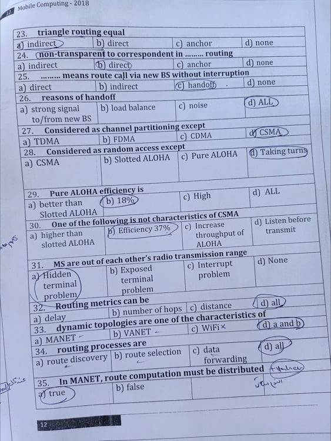

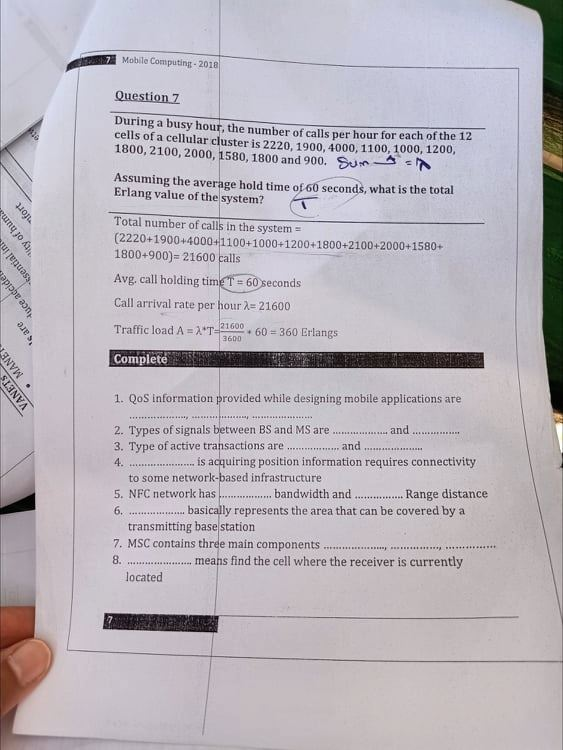

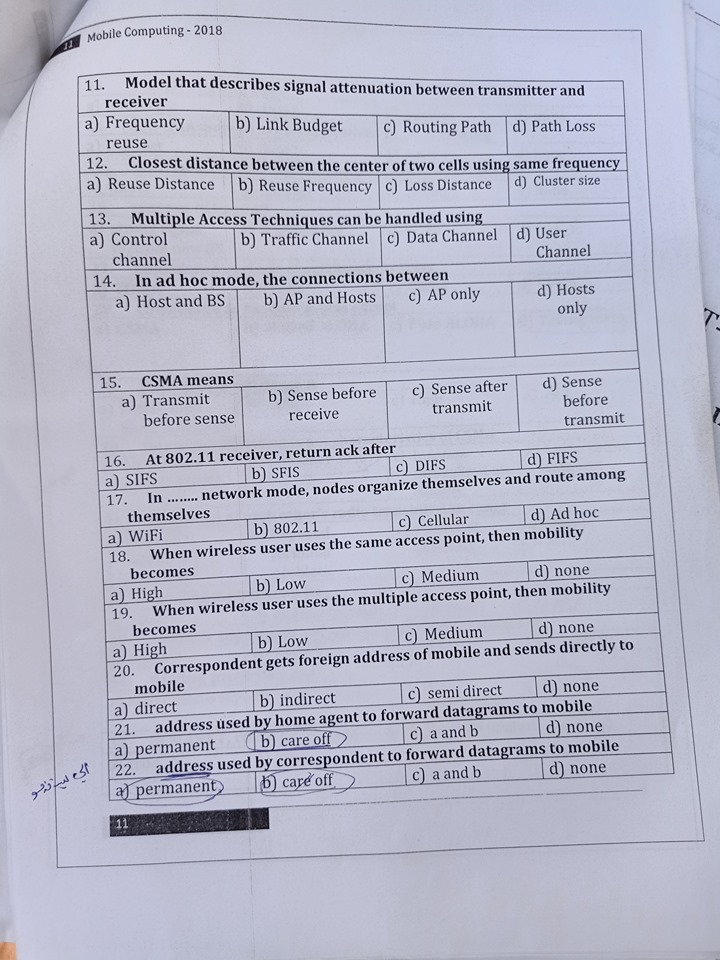

- 11 => Path loss
- 12 => Reuse Distance 
- 13 => Control Channel
- 14 => Hosts Only
- 15 => Sense Before Transmit
- 16 => SIFS
- 17 => Adhoc
- 18 => Low
- 19 => High 
- 20 => direct
- 21 => Care off
- 22 => Permanent

## The Main Process of Call Setup 
authentication => Location Management => allocate uplink and the downlink => admission control (Handoff) The Maintenance of a call


## This Course Is Indrotuced by Dr : Noha Hikal
### @AhmedKhalil contribution 2019/2020
