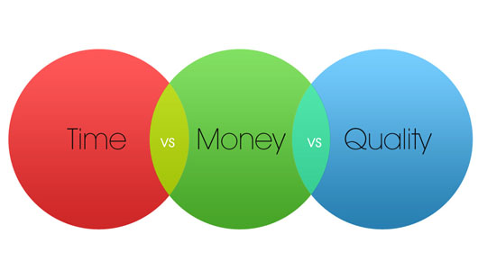
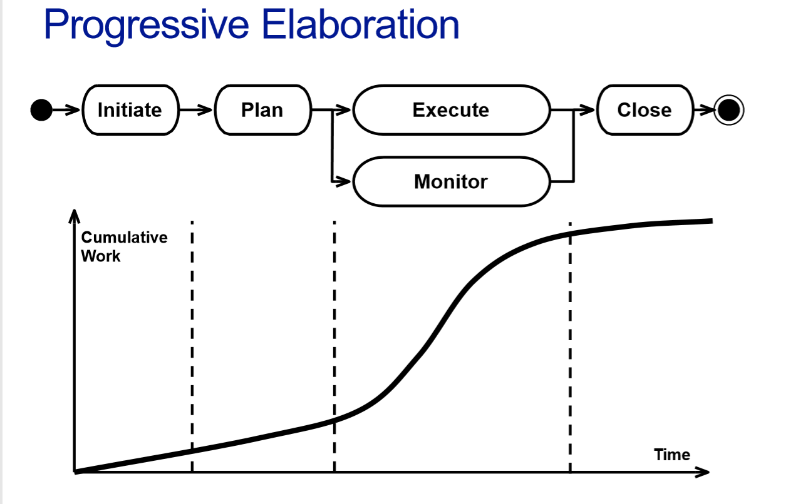
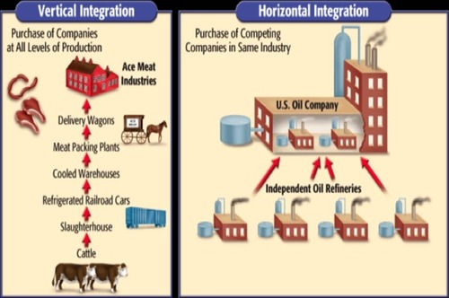

# In The Name of Allah 

## The Final Exam In Shaa AllAH Contents of Software Project Management

|Lectures| Elements of Study|Contributed|
|:--:|:--|:--|
| Lecture 1|Motivations , Goal of The Course , Intro to SPM|<input type="button" style="background:green" value="Right"/> |
| Lecture 2 |History of SPM , What is the Project ? , Types of Development Projects , (The Players)Who are Stakeholders? |<input type="button" style="background:green" value="Right"/>|
| Lecture 3|Why Project Management? , Framework of SPM , SDLC =>The Very Common(Life Cycle of Development) |<input type="button" style="background:red" value="Wrong"/> |
| Lecture 4|<li>How to select a project</li><li>Project Value and  Risks </li><li>Techniques to Assess  Value and Risks=> Quantitative methods(Payback period , ROI , NPV)|<input type="button" style="background:red" value="Wrong" /> |
| Lecture 5|<li>Techniques to Assess Value and Risks=> Qualitative methods(Score Matrix , SWOT )</li><li>Stakeholders analysis </li> Assessing Sustainability => Business Model , Break Even Point </li><li>Feasibility Study , Approval of the Project</li>|<input type="button" style="background:red" value="Wrong"/> |
| Lecture 6 |<li>Estimation Time =>Effort, Duration ,Resources </li><li>Controlling Uncertainty in  Planning</li><li>Estimation  Techniques => (Expert Judgement => Quick and Dirty, PERT, Algorithmic Technique=>(Function Points , COCOMO=> Size Based))</li>|<input type="button" style="background:red" value="Wrong"/>|
| Lecture 7 |<li>Recap Algorithmic Technique </li><li> Project Scheduling (Identify the Dependencies ,(Hard vs Soft , SS/FS/SF/FF) )</li> <li>CPM Critical Path Method</li><li> Resource Allocation  and Resource  Leveling</li>|<input type="button" style="background:red" value="Wrong"/>|
| Lecture 8 |<li> How To Make Your Plan Feasible => (Project Crashing , Fast Tracking , CCM Critical Chain Management) </li><li> Costing and Budgeting (Direct vs Indirect,Costing => CES over WBS)</li>|<input type="button" style="background:red" value="Wrong"/>|
| Lecture 9 |<li>Project Execution,  Monitoring, and  Control</li><li>Kicking of Activities </li> <li>Monitoring Schedule (Monitoring Costs => (Earned Value Analysis))</li><li> Agile Monitoring and Control(SCRUM => Burndown/up Chart)</li><li>Project Closing</li>|<input type="button" style="background:red" value="Wrong"/>|
| Lecture 10 |<li> Chang Control & Configuration Management</li><li>Risk Management </li><li> Quality Management</li>|<input type="button" style="background:red" value="Wrong"/>|
---
# Lecture 1

## Motivations

- in order to build good software => We need a well  defined and managed process => Project Management
- If you want to deliver on __time__ and with in __budget__ a  product which has the __quality__ properties agreed upon 
  - A __process__ to define a *schedule*, a *budget*, and agree on the  (*quality*) characteristics of a product.

  -  A __list of techniques__ to _define_, _agree_, _plan_, _execute_, and  _monitor_: __goals, quality, time, and costs__

> The Project Management techniques are intrinsically  __multidisciplinary__ 

## Software project management is interesting and  challenging because of :

- The product is __intangible__ => You Can not Touch

- The product is __uniquely flexible__  => Different Sizes , Different Constraints

- Many software projects are __'one-off'__ => Designed for Specific Users or Company
- The development process is __uniquely flexible__ => You can move forward and backward and change code any time you wish
- Size and complexity are __increasing exponentially__ => you must find the appropriate design patterns to solve problems =. Software Crisis??
- Human lives might depend on software running  => __Safety Critical Systems__

---
# Lecture 2 

## Brief History

|PERSON|Works|
|:-|:-|
|__Taylor__<li>|<li> Taylor’s “Scientific Management” is the first theory  of work and management <li> Beginning of 1900 <li> A negative view of workers (they perform at the  slowest rate which goes unpunished) <li> Some more interesting characteristics:<ul> <li> Scientific definition of work <li>Scientific selection of personnel<li> Sharing of responsibilities between workers and  management <li>Incentives and rest periods (to make workers more  efficient)|
|__Henry Gantt__<li>|<li>Gantt’s “Gantt chart” notation is still used  today to schedule projects <li> Defined during the First World War <li> First used to schedule and monitor work and progress in ship building: distinction between __work and progress__|

|Date|Events|
|:-|:-|
|2nd World War| Manhattan Project: process flow diagrams |
|1957|__CPM (Critical Path Method)__ =>Dupont+ UNIVAC team => Lecture 7 |
|1958|__PERT ((Program Evaluation and Review  Technique))__ => United States Navy <li> Can be mixed with CPM => see PERT/CPM|
| 1960’s |<li> PERT/COST  <li> EVA (Earned Value Analysis)<li>  Configuration Management => Lecture 10 <li> IPMA ,  PMI => a unique institute for studying Project Management <li> IBM uses PM commercially|
|1970 |<li>Software Development has a PM process<li>__EVA__ developed for monitoring schedule and cost <li>__Waterfall model__ for software development <li> The mythical man-month highlights many pitfalls of software  development|
|1980’s|<li> __Hardware and software__ proliferation make PM tools __accessible__ to __smaller__  firms <li> Hardware capacity grows exponentially __(Moore’s Law)__ and so does software <li> Estimation models __(FP and COCOMO)__ => (Lecture 6) are introduced to predict software complexity|
|1990’s |<li>Total quality <li>Leaner, quicker, more responsive organizations|
|Today|<li>Web application and new application distribution models <li> Development with components and frameworks <li> Agility, quick interaction, constant feedback|

## What is a project => The Name of Game
> A project is a __temporary__ endeavor undertaken to  create a unique __product__, __service__, or __result__

 - Temporary => Has time Boundaries => Start and End time
 - Can Be a product (Phone , Food , Hat , laptop, building , Software you Sell)
 - Can be a Service (Health Care , Learning , ...)
 - Can be a result (Exam passing , Football match, ....)
 - Progressive elaboration =>  Development by steps and in increments
 -  Resource constrained (كل من عليها فان,,  زى اى حاجة بتخلص الوقت و الفلوس و الموارد)

> __Sub projects__ => Projects may be __divided__ in sub projects (although the sub projects may be referred to as “projects” and managed as such)

> Projects As a __Program__ => __Related Projects__ Coordinated to achieve Benefit

> Hybrid projects As a __portfolio__ => __UnRelated Projects__ grouped together to facilitate management and meet strategic  objectives

|Project|VS|Operational Work|
|:-|:-|:-|
|Performed by people |<input type="button" style="background:green" value="SAME"/>|Performed by people|
|Limited resources|<input type="button" style="background:green" value="SAME"/>|Limited resources|
|Planned, executed, and controlled|<input type="button" style="background:green" value="SAME"/>|Planned, executed, and controlled|
|obtain goals and __terminate__ => __Temporary__|<input type="button" style="background:red" value="Different"/>|sustain the business => Can be __Permanent__ if the organization sustain |
- Writing a paper => Project
- Developing a software system => Project
-  Maintaining a software system => Operational Work
- Managing personnel => Operational Work

## Software  Development  Projects
- ### Application Development
    - Goal: __developing an application__ (desktop, web, mobile,  embedded) 
    - The Most fun => you gonna code 
    - Types of application development: 
      - One Offs : for one client (Vertical Systems)
      - Off the Shelf : Support group of users (Horizontal Systems)
      - Customized off-the-shelf => Think about (Oracle, Oddo , Godaddy , Wordpress) when Customizing The ERP or Website system to some organization
- ### Process and Systems Re-Engineering 
  - Goal: change the way in which the __operational work__ of  an organization is carried out to achieve __some strategic  goal__ (e.g., improve quality, become more efficient)
  - تحسين أداء العمالة بالمنظمة
  - Typically large projects which involve an accurate  analysis of the existing situation (“as is”) w.r.t.  procedures, systems, infrastructure
  - بتكون معظما للمشاريع الكبيرة اللى بيتحكم فيها على تفاصيل اداءها بتفضل زى ماهى او بيتعدل فى العمليات 
  - Often the support of the introduction of an ERP system  and require system and data integration activities.

- ### System Integration 
    - Goal: automating the information flow among the  systems of an organization 
    - أسهل حركة المعلوات داخل المنظمة و انتقال المعلومة من نظام لنظام
    - Types of integration:
      -  __Vertical__: integration of systems performing __similar  operations__ 
      -  __Horizontal__: integration of systems automating __different steps of a  procedure__ 

- ### Consulting Services 
    - Typically asked to gain a know-how outsize a company’s core  competence
    - بتحاول تتعرف على المنظمة وايه شغلها و قوتها 
- Installation and Training
  - Services related to the installation or training on specific  software systems 
  -  Remark: also a __revenue model in open source development__

## Project Stakeholders
> is any __individual or an organization__ that is  actively involved in a project, or  whose interest might be affected  (__positively or negatively__) as a result  of project execution or completion. 
 
### Some characteristics:
- They may have __different influence__ and varying level of  responsibility during the project 
- They may play __different roles__
-  They may have __positive or negative influence__ on the project 
- They may be __difficult to identify__ 
- Their __lack of intervention__ may negatively influence the project  (need for identification and involvement) 
> Remark: the __project manager__ and the __project team__ are __project stakeholders__, although the term is often used to refer to the __“other”__ stakeholders

### Types of Stakeholders

- The project manager
- The project team 
-  The project sponsor 
-  The performing organizations 
-  The partners 
-  The client 
-  The __“rest”__: anyone who might be affected by the project  outputs

### Key Stakeholders

- __*Internal*__=> (Project team members,  Project management team)
- __*In between*__: – Customer/User
  -   There may be multiple layers of users 
      -   __Sponsor__: person or group providing the financial resources 
      -   __Performing Organization__: the organization mostly involved in the  project
-  __*External*__:  __Influencers__: people or groups not directly related to the project who  could influence the course of a project

> __Project Manager__ => Person responsible of __managing__ the project and stakeholders’  expectations

- Someskills 
  - Communication and negotiation skills 
  -  A little predisposition to risk 
  -   Goal orientation 
  -    Leadership 
  -  A bit of thinking outside the schemes 
  -  Solid know-how 
  -  Professional correctness 
  -   A lot of common sense 
  -  A bit of style

## The code of conduct of the PMI:
- 1. __Responsibility__: • the duty of __taking ownership of decisions__ made or failed to make and their consequences 
- 2. __Respect__: • the duty of treating with __respect the resources__ assigned to us, such as people, money, reputation, environment, and so on 
- 3. __Fairness__: • the duty of taking __decisions impartially and objectively__
-  4. __Honesty__: • the duty of __acting in a truthful manner__.
## This Course Is Indrotuced by Dr : Mohammad Seyam
### @AhmedKhalil contribution 2019/2020

