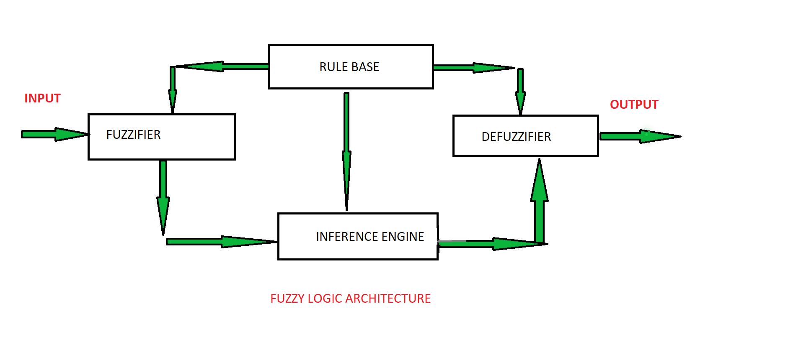

# In The Name Of ALLAH
# Fuzzy Logic | Introduction
> The term fuzzy refers to things which are not clear or are vague. In the real world many times we encounter a situation when we can’t determine whether the state is true or false, their fuzzy logic provides a very valuable flexibility for reasoning. In this way, we can consider the inaccuracies and uncertainties of any situation.

- In boolean system truth value, __1.0 represents__ absolute truth value and __0.0 represents__ absolute false value.
- But in the fuzzy system, there is __no logic for absolute truth and absolute false value.__
- But in fuzzy logic, there is __intermediate value__ too present which is _*partially*_ true and __partially false.__

## ARCHITECTURE

Its Architecture contains four parts :

- __RULE BASE:__ It contains the set of rules and the __IF-THEN conditions__ provided by the experts to govern the decision making system, on the basis of linguistic information. Recent developments in fuzzy theory offer several effective methods for the design and tuning of fuzzy controllers. Most of these developments reduce the number of fuzzy rules.
- __FUZZIFICATION:__ It is used to convert inputs i.e. crisp numbers into fuzzy sets. Crisp inputs are basically the exact inputs measured by sensors and passed into the control system for processing, such as temperature, pressure, rpm’s, etc.
- __INFERENCE ENGINE:__ It determines the matching degree of the current fuzzy input with respect to each rule and decides which rules are to be fired according to the input field. Next, the fired rules are combined to form the control actions.
- __DEFUZZIFICATION:__ It is used to convert the fuzzy sets obtained by inference engine into a crisp value. There are several defuzzification methods available and the best suited one is used with a specific expert system to reduce the error.

