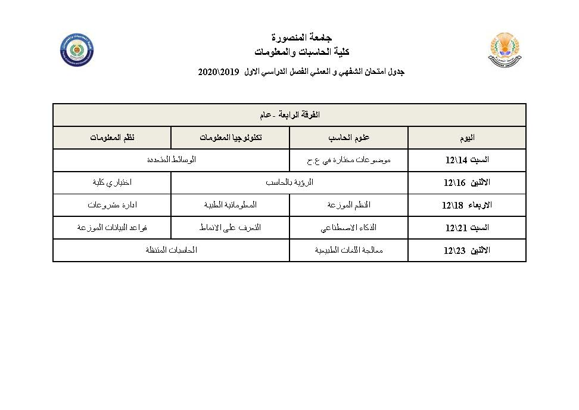

# بسم الله الرحمن الرحيم
__الحمد لله، الذي نحمده ونستعينه، ونعوذ به من سيئات أعمالنا، ونعوذ به من شرور أنفسنا، فمن يهديه الله عز وجل فلا يكن له مضل، ومن يضلله الله سبحانه وتعالى فلا يكن له هادي، والصلاة والسلام على رسول الله، سيدنا محمد خير الأنام، صلى الله عليه وسلم، وعلى آله وصحبه__
 
__أما بعد يا أصدقائى ,فهذا المكان مخصص لربط المحاضرات و المشاريع لدينا فى الدفعة لنساعد به بعضنا البعض , و أسأل الله ان ينفع به و يحقق زروته__
 
__من يريد ان يساعد هنا يتواصل معى باذن الله__
 
__لو كنت عايز تعمل داونلود لأى فولدر انسخ رابط الفولدر وضع الرابط فى الصفحةبعد الضغط على زرار__
__Push__

# 4th_Grade_IS-Master-
This Repository for studying the Last year of IS in Mansoura University Containing {Courses , Projects , Modules , Deadlines}
 

 <button class = "markdown-button" type="introbutton">[SEE RECIPE][1]</button>
 

 - The Oral Practical Table
 - 

 - The Exam Table 
 - 

 [1]: /recipes/braised-lamb-shank
 
