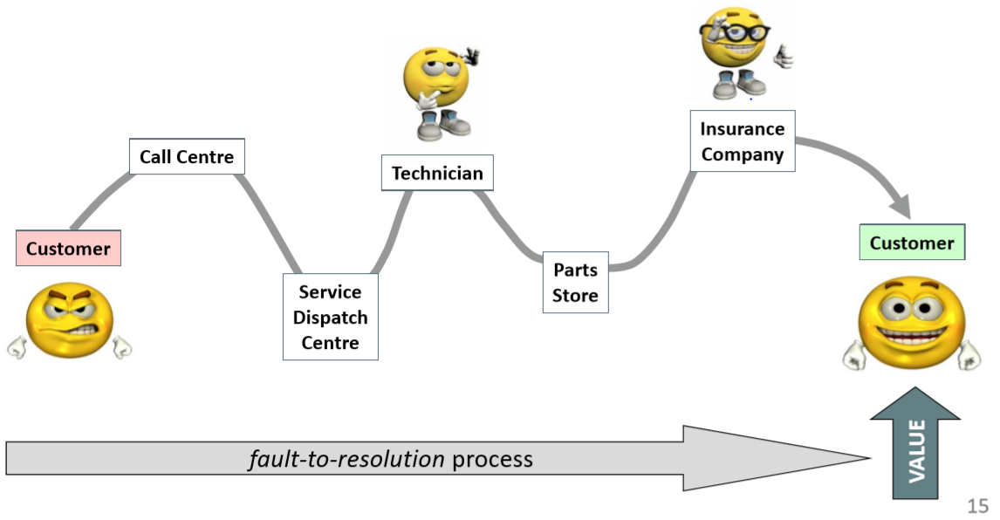
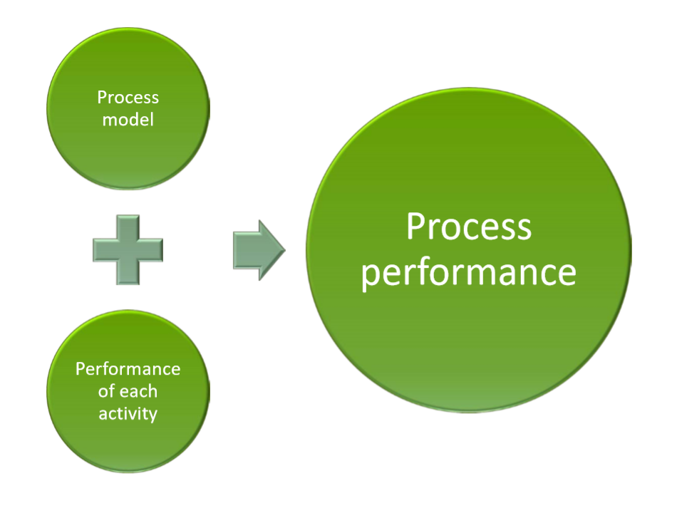

# In The Name Of Allah

> Dr Mohammad Seyam : Mansoura University
> Editor for the document: Ahmed Khalil

---

## Lecture 1

## Objective of The Course

> To introduce the discipline of **modeling**, **analyzing**, **automating** and **monitoring business processes**.

## Related Courses

- Enterprise System Integration {مادة دكتور هيثم الترم التانى}
  - Integrating applications to automate or support business processes
- Business Analysis and Software Product Management
  - Identifying and analyzing business problems and opportunities that can be addressed via IT solutions, including business process improvement opportunities
- Data mining / Business data analytics
  - Mining business process execution logs

## What is Business Process

- a chain of **events**, **activities** and **decisions**
  ...involving a number of _actors_ and _objects_,
  ….triggered by a need and leading to an **outcome** that is of **_value_** to a customer
- Examples:
  - Order-to-Cash
  - Procure-to-Pay (aka Purchase-to-Pay)
  - Application-to-Approval
  - Fault-to-Resolution
- Real Example
  > My washing machine doesn’t work…
  - Type "Fault to Resolution"
  - Negative outcomes (value-reducing):
    - Fault not repaired in a timely manner
    - Fault repaired but customer pays more than expected
  - Positive outcomes (value-adding):
    - Fault repaired immediately with minor intervention
    - Fault repaired, covered by warranty
  - 

## How To Define a process

- Think of an organization and a process in this organization:
  - Is it order-to-cash, procure-to-pay, fault-to-resolution…
  - Who is/are the customer(s)?
  - What value does this process deliver to its customer?
  - Who are the key actors of the process?
  - List at least 3 outcomes of the process

## What is the BPM / Why Should I Care about it

- 
- If you had to choose between two services, you would typically choose the one that is:
- Fastest === Time
- Cheapest === COST
- Better === Quality

- To Improve performance, it's not a technology Issue.
  - Automation is the last thing you care about after curing the process.

---

## Lecture 2

> BPM : Body of **principles**, **methods** and **tools** to **design**, **analyze**, **execute** and **monitor** **_business processes_**, with the aim of improving their performance.

---

> “The first rule of any technology used in a business is that automation applied to an efficient operation will magnify the efficiency.
> The second is that automation applied to an inefficient operation will magnify the inefficiency. ” Bill Gates

- 
- Information technology doesn't yeild the business value
- But the Information Technology enable us to change the process, and the process yeilds the business value.

- The BPM Now is skill which all organizations aim to find in its people.

## BPM LifeCycle

- 
- Process Identification Steps
  - Designation Step
    - Enumerate Business Process
    - Determine Process Scope
    - Delivery Process Architecture
    - 
  - Prioterization Step => Selection Step
    - Prioterize the Peocesses based on:
      - Health => DysFunction
        - Which processes are in **deepest trouble**
      - Importance
        - Which processes have **greatest impact** on the organization‘s **strategic objectives**
      - Feasability
        - Which processes are **most susceptible** to successful process management?
    - Delivery **_Priterized Process Portfolio_**
    - 
- Process Discovery Step
  - Ordering the Processes to make it like a sequence
  - Delivery **_AS IS Process Model_**
  - 
- Process Analysis
  - Qualitative Analysis
    - Root Cause Analysis
  - Quantitative Analysis
    - Simulation of Process to get info about
      - COST
      - Resource Utilizations
      - Durations (Waiting Times vs Process Time)
    - Delivery Insights in weeknesses and Impacts
- Process Redesign
  - This Level to Use
    - Transformational BPR {Explorative}
    - Transactional Huristics Redesign
    - Delivery **To Be Process Model**
    - Devil's Quadrile?
    - 
- Process Implementation
  - Process Automation
  - Process Change Management
  - Delivery Executable Process Model
    - 
- Process Monitoring and contolling
  - Delivery Conformance and Performance Insights
  - 

---

## Lecture 3 Process Identification

> The world was so recent that many things lacked names, and in order to indicate them it was necessary to point to them with the finger.

- من غير تعريف للعمليات اللى فى النظام و بالتالى بتعقيد النظام هيبقى حتى صعب انك تشاور بصباعك على العمليات

- Process Identifications

  - What?
    1. Identify an organization’s business processes => Process Architecture
    2. Prioritize their management based on certain criteria => Prioterized Processes Portfolio
  - Why?
    1. Understand the organization
    2. Maximize value of BPM projects

- Chevron
  - Collabesd Value Chain
- Box
  - Group of Process value chain
  - In Level 2 Can be **_Group of Chevrons_** or **expanded process group**

## Typical artifacts for varitical scoping

- Value chains Chains of processes
  - Stay at a high level. Rule of thumb: 3-7 processes
  - Procure-to-service, Risk management
- (Root/Main) Processes
  - Build up value chains and affect each other.
  - They are abstract • Lead-to-quote, Quote-to-order, Order-to-cash
- Subprocesses Build up processes.
  - They are detailed, involve multiple activities and can be layered on different levels of abstraction (i.e. sub-subprocesses)
  - • Order shipment, invoicing
- Process tasks Build up processes and sub-processes.
  - They are atomicand performed by human beings, IT systems or equipment Approve invoice

> Typical enumeration on 2 steps only **Value Chain and the Root/Main Processes**

- Reference Models
  > A reference model is used as a **template** to design the process architecture
- eg ITIL, SCOR

## Prioritazation

## 

## Lecture 4 Process Qualitative analysis Analysis

- Value-Added & Waste Analysis => Insights
- Root-Cause Analysis => Insights
- Pareto Analysis => a way to visualize insights
- Issue Register =>
- 

## Value-added analysis

- Decorticate the process into steps

  - Steps performed before a task
  - The task itself, possibly decomposed into smaller steps
  - Steps performed after a task, in preparation for the next task

- Classify each step

  - Value-adding (VA)
  - Business value-adding (BVA)
  - Non-value-adding (NVA

### Value-Added Activities => Maximize

> **Produce value or satisfaction** to the customer

- Criteria
  - Is the customer willing to pay for this step?
  - Would the customer agree that this step is necessary to achieve their goals?
  - If the step is removed, would the customer perceive that the end product or service is less valuable?
- Examples
  - Order-to-cash process: Confirm delivery date, Deliver products
  - University admission process: Assess application, Notify admission outcome

### Business Values-Added Activities => Minimize

> **Necessary or usefu**l for the **business** to operate

- Criteria
  - Is this step required in order to collect revenue, to improve or grow the business?
  - Would the business (potentially) suffer in the long-term if this step was removed?
  - Does it reduce risk of **business** losses?
  - Is this step required in order to comply with **regulatory** requirements?
- Example
  - Order-to-cash process: Check purchase order, Check customer’s credit worthiness, Issue invoice, Collect payment, Collect customer feedback
  - University admission process: Verify completeness of application, Check validity of degrees, Check validity of language test results

### Non-Value Adding Activities

> **Everything else** besides VA and BVA.
> Activities the customer would be **unwilling** to pay for

- Incudes
  - Handovers, context switches
  - Waiting times, delays
  - Rework or defect correction
- Examples
  - Order-to-cash process: Forward PO to warehouse, Re-send confirmation, Receive rejected products
  - University admission process: Forward applications to committee, Receive admission results from committee
    

## Waste Analysis

> “All we are doing is looking at the time line, from the moment the customer gives us an order to the point when we collect the cash. And we are reducing the time line by reducing the non-value-adding wastes” TaiichiOhno, Toyota

### 7 Resources of Waste

- Move
  - Transportation
    - **Send or receive materials or documents** (incl. electronic) taken as input or output by the process activities
    - لو أقدر اتعامل مع الملفات دى من مكان واحد يا حبذا
  - Motion
    - _Motion_ of resources internally within the process
    - _Common_ in **manufacturing processes**, _less common_ in **service processes**
- Hold
  - Inventory
    - Materials inventory
    - Work-in-process (WIP)
  - Waiting
    - Task waiting for materials or input data
    - Task waiting for a resource
    - Resource waiting for work (resource idleness)
- Over-do
  - Defects
    - Correcting or compensating for a defect or error
    - Rework loops
  - Over-Processing
    - Tasks performed unnecessarily given the outcome of the process
    - Unnecessary perfectionism
    - بيبص للوقت اللى ضاع و مالهوش لزمة كبيرة
  - Over-Production
    - Unnecessary process instances are performed, producing outcomes that do not add value upon completion
    - بيبص لكمية الشغل اللى مش بيتنفذ الا جزء بسيط منه

## ISSUE Register

- Purpose: to maintain, organize and prioritize perceived **weaknesses** of the process (issues)
- Sources of issues:
  - Input to the BPM project
  - Collected during process discovery (e.g. during modelling workshops)
  - Collected via stakeholder analysis
    - Customers
    - Process participants (workers)
    - Process owner / managers
    - Subcontractors, business partners

### ISSURE Register Structure

- Can take the form of a table with:
  - Issue identifier
  - Short name
  - Description
  - Assumptions
  - Impact: Qualitative and Quantitative
  - Possible improvement actions
    > Larger process improvement projects may require **issue trackers**

## Pareto Chart

- Useful to prioritize a collection of issues
- Bar chart where the height of the bar denotes the impact of each issue
- Bars sorted by impact
- Superposed curve of cumulative percentage

## PICK Chart

## ROOt Cause Analysis

- Why-Why Diagram
  > From Issue to find the Factors
  - Five levels of Nesting
- Cause Effect Diagram
  > Can reach from the factors to issues or vise versa
  - Fishbone Diagram
  - 
  - 6 Ms
    - Machine
    - Method
    - Material
    - Man
    - Measurement
    - Milleu => Outside of Scope

## Lecture 5 Process Analysis Quantitative Methods

- Flow analysis
- Queuing analysis => Not Course
- Simulation => Not Course Based

## Flow Analysis

### Performance Measure

### Time Measure

- Cycle time = Peocessing Time + Waitting Time
- Cycle Time Efficancy = Processing Time / Cycle Time
- 

### Cost Measures

- Per-Instance Cost = Processing Cost +Cost of Waste
- 
- Typical Components of Cost
  - Material Cost
    - Cost of **tangible or intangible resources** used per process instance
  - Resources Cost
    - Cost of **person-hours employed** per process instance
- Resource Utilization = Time Spent per resource on work / Time Avilible for resource
- Resource utilization = 60% on average resources are idle 40% of their allocated time
- 

## Quality

- Product quality
  - Defect rate معدل الاخطاء للمنتج
- Delivery quality
  - On-time delivery rate هل العميل معظما بيستلم فى الوقت المحدد
  - Cycle time variance مدى التباعد و التقارب بين المدد
- Customer satisfaction
  - Customer feedback score المستخدم و تقييماتها

### Identifying Performance Measure

- For each process, formulate process **performance objectives**
  - Customer should be served always in a timely manner
- For each objective, identify _variable(s)_ and _aggregation method_ _performance measure_
  - Variable: customer served in < 30 min.
  - Aggregation method: percentage
  - Measure: ST30 = % of customers served in < 30 min.
- For each performance measure, define **targets**
  - ST30 > 99%

### Process Performance Reference Model

- Supply Chain Operations Reference Model (SCOR)
  - Performance measures for **supply chain management** processes American Productivity and Quality Council
- (APQC)
  - Performance measures and benchmarks for processes in the Process Classification Framework (PCF)
- IT Infrastructure Library (ITIL)
  - Performance measures for IT service management processes

## Flow Analysis

- 
- 
- 
- Limitation 1 : Not all Models are Structured
  - Estimation be in averages but there are many not structured ways
- Fixed arrival rate capacity
  - Cycle time analysis does not consider:
    - The rate at which new process instances are created (arrival rate)
    - The number of available resources
  - Higher arrival rate at fixed resource capacity - high resource contention - higher activity waiting times (longer queues) - higher activity cycle time - higher overall cycle time

> The slower you are, the more people have to queue up… • and vice-versa

## Practical Annotations

- Automated tasks are further classified into the following
  subtypes in BPMN:
  - **_Script (script marker)_** , if the task executes some code (the
    script) internally to the BPMS. This task can be used when the
    functionality is **simple** and **does not require access** to an
    _external_ application.
  - **_Service (gears marker)_** , if the task is **executed by an external
    application** , which exposes its functionality via a service
    interface.
  - **_Business rule (table marker)_** , if the task **triggers** a business
    rule to be executed by a rules **engine external to the BPMS**.
  - **_Send (filled envelope marker)_** , if the task **sends** a message to
    an external service.
  - **_Receive (empty envelope marker)_** , if the task **waits** for a
    message from an external service.
